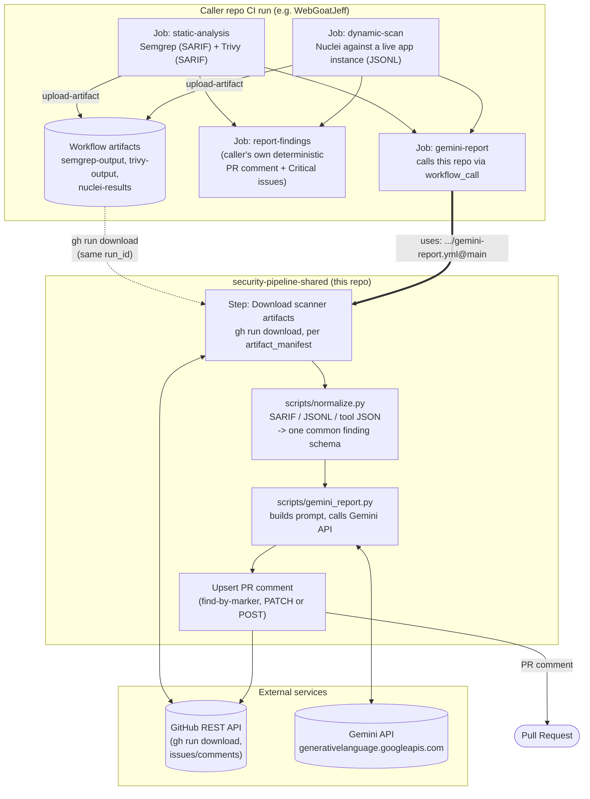
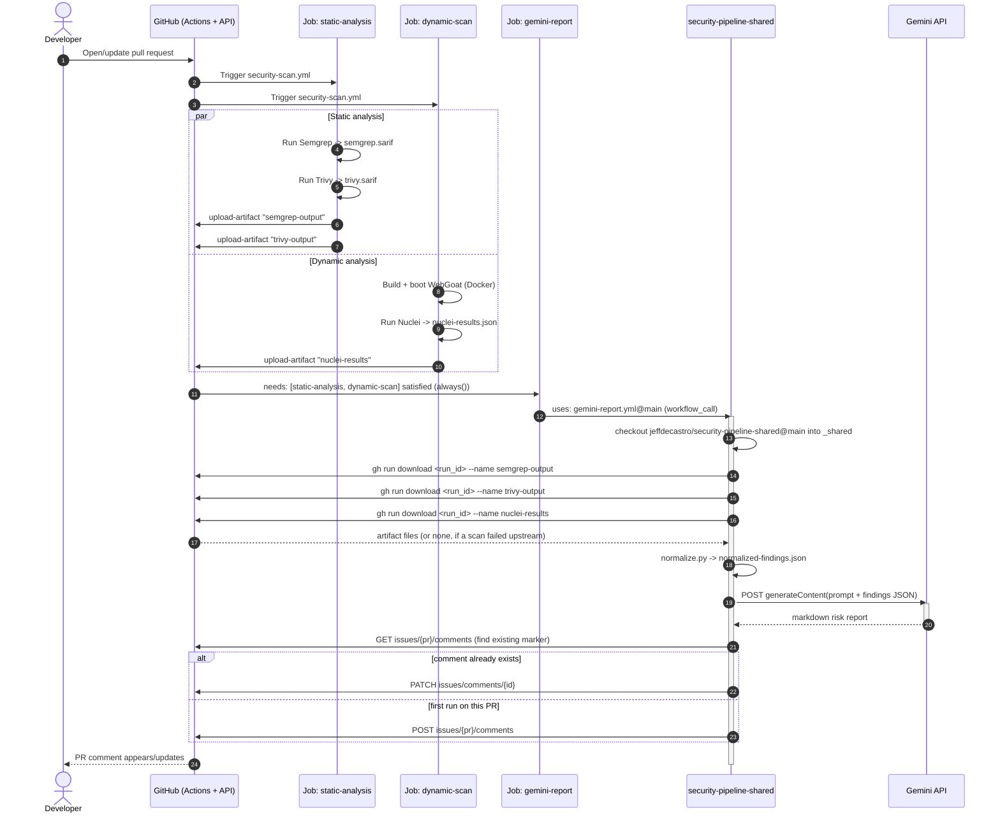

# security-pipeline-shared

A shared, reusable GitHub Actions workflow that turns raw security-scanner
output into a single, dev-readable, CWE-aware, risk-prioritized pull request
comment — generated by Gemini.

It is designed to be called (via `workflow_call`) from other repositories'
CI pipelines *after* those pipelines have already run their own scanners
(Semgrep, Trivy, Nuclei, Brakeman, ZAP, ...) and uploaded the raw output as
build artifacts. This repo does not run any scanners itself — it only
normalizes, summarizes, and comments.

It is currently consumed by [`jeffdecastro/WebGoatJeff`](https://github.com/jeffdecastro/WebGoatJeff)'s
`security-scan.yml` workflow as an experimental, second PR comment running
alongside that repo's own deterministic findings report.

---

## Table of contents

- [Why this exists](#why-this-exists)
- [High-level architecture](#high-level-architecture)
- [End-to-end sequence diagram](#end-to-end-sequence-diagram)
- [Repository layout](#repository-layout)
- [The reusable workflow: `gemini-report.yml`](#the-reusable-workflow-gemini-reportyml)
  - [Inputs](#inputs)
  - [Secrets](#secrets)
  - [Job steps in detail](#job-steps-in-detail)
- [The normalized finding schema](#the-normalized-finding-schema)
- [`normalize.py`: parser support matrix](#normalizepy-parser-support-matrix)
- [`gemini_report.py`: prompt and comment lifecycle](#gemini_reportpy-prompt-and-comment-lifecycle)
- [How a calling repo wires this in](#how-a-calling-repo-wires-this-in)
- [Failure philosophy: never break the caller's build](#failure-philosophy-never-break-the-callers-build)
- [Permissions and secrets handling](#permissions-and-secrets-handling)
- [Extending: adding a new scanner parser](#extending-adding-a-new-scanner-parser)
- [Known limitations](#known-limitations)
- [Local development / testing](#local-development--testing)

---

## Why this exists

Most CI security pipelines end up with three or four scanners, each with its
own output format (SARIF, JSONL, tool-specific JSON), each with its own idea
of what "severity" means, and each producing walls of low-signal findings
that developers learn to ignore. Two problems fall out of that:

1. **No single place to look.** A reviewer has to open the Semgrep tab, the
   Trivy tab, and the Nuclei artifact separately to understand the real risk
   introduced by a PR.
2. **No risk framing.** Raw scanner output is sorted by tool, not by
   "what should I actually fix before merging this." A `CRITICAL` from a
   SAST tool on dead code is not the same risk as a `MEDIUM` finding that a
   DAST tool *confirmed* is reachable over the network.

This repo solves both by centralizing the "explain this to a human" step:
it merges every scanner's output into one common schema, then asks Gemini
to produce a short, skimmable, risk-ranked markdown comment — while leaving
the original scanner severities untouched and auditable.

It is intentionally **reporting-only**. It never fails a build, never blocks
a merge, and never modifies repository files. See
[Failure philosophy](#failure-philosophy-never-break-the-callers-build).

---

## High-level architecture

The system has two halves that live in two different repositories:

- **Caller repo** (e.g. `WebGoatJeff`): owns and runs the actual scanners
  (Semgrep, Trivy, Nuclei, ...), uploads their raw output as workflow
  artifacts, and then calls into this repo via `workflow_call`.
- **This repo** (`security-pipeline-shared`): owns nothing scanner-specific.
  It downloads the artifacts the caller already produced *in the same run*,
  normalizes them, and calls the Gemini API to generate one PR comment.



Key architectural properties visible in the diagram:

- **Artifacts are the only data channel.** This repo never touches the
  caller's source code or scanner configuration — it only reads workflow
  artifacts that the caller already uploaded, addressed by name via the
  `artifact_manifest` input.
- **Same run, cross-job.** `gh run download` pulls artifacts from
  `github.run_id`, i.e. the *caller's* run. Because `gemini-report.yml` is
  invoked with `uses:` (not a separate `workflow_dispatch`), it executes as
  a job *inside* the caller's own run, so `github.run_id` is shared.
- **One outbound call to an LLM.** The only external dependency beyond
  GitHub itself is the Gemini API, called once per invocation with the full
  normalized findings array.
- **Idempotent comment.** The PR comment is upserted by a hidden HTML
  marker, not appended, so re-running the workflow on the same PR updates
  the existing comment instead of spamming new ones.

---

## End-to-end sequence diagram

This shows one concrete run: a pull request opened against the caller repo,
triggering `security-scan.yml`, which eventually calls into this repo's
`gemini-report.yml`.



Note the `alt`/`else` upsert branch and the `par` block for the two
independent scanner jobs — both are load-bearing details reflected directly
in the code (see [`gemini_report.py`](scripts/gemini_report.py) and
[`security-scan.yml` in the caller repo](https://github.com/jeffdecastro/WebGoatJeff/blob/main/.github/workflows/security-scan.yml)).

---

## Repository layout

```
security-pipeline-shared/
├── .github/
│   └── workflows/
│       └── gemini-report.yml     # the reusable workflow (workflow_call)
├── scripts/
│   ├── normalize.py              # SARIF / JSONL / tool-JSON -> common schema
│   └── gemini_report.py          # prompt building, Gemini call, PR comment upsert
└── README.md                     # this file
```

There is no build step, no dependency manifest, and no test suite in this
repo today — both scripts are dependency-free stdlib Python 3.12 and are
invoked directly by the workflow.

---

## The reusable workflow: `gemini-report.yml`

Declared as `on: workflow_call`, so it cannot run on its own — it only
executes when another workflow references it with `uses:`.

### Inputs

| Input | Type | Required | Description |
|---|---|---|---|
| `pr_number` | `string` | yes | The pull request number to comment on. The caller is responsible for only invoking this on PR-triggered runs (see the `if: github.event_name == 'pull_request'` guard in the example caller). |
| `artifact_manifest` | `string` | yes | Comma-separated `parser-key=artifact-name` pairs, e.g. `semgrep-sarif=semgrep-output,trivy-sarif=trivy-output,nuclei-jsonl=nuclei-results`. The `parser-key` must match a key in `normalize.py`'s `PARSERS` dict; the `artifact-name` must match the `name:` used in the caller's `actions/upload-artifact` step. |

### Secrets

| Secret | Required | Description |
|---|---|---|
| `GEMINI_API_KEY` | yes | Google Gemini API key, passed through from the caller's own repo/org secrets. Never stored in this repo. |

### Job steps in detail

The job `gemini-report` runs on `ubuntu-latest` with a 10-minute timeout and
requests only `contents: read` + `pull-requests: write`.

1. **Checkout shared scripts** — checks out *this* repo (`main`) into a
   `_shared/` subdirectory of the caller's workspace, so the caller doesn't
   need to vendor these scripts itself. Pinned to a specific
   `actions/checkout` commit SHA (`9c091bb2...` / tagged `v7.0.0`).
2. **Download scanner artifacts and build parser args** (`id: fetch`,
   `continue-on-error: true`) — parses `artifact_manifest`, and for each
   pair calls `gh run download <run_id> --name <artifact>`. Failures per
   artifact are swallowed (`|| true`) so a missing artifact (e.g. because an
   upstream scan step failed) doesn't abort the whole job — it's simply
   omitted from the `parser_args` output.
3. **Set up Python** — `actions/setup-python@v6`, Python `3.12`.
4. **Normalize findings** (`continue-on-error: true`) — runs
   `_shared/scripts/normalize.py` with the `parser_args` built above,
   writing `normalized-findings.json` and echoing it to the log for
   debuggability.
5. **Generate Gemini report and post PR comment**
   (`continue-on-error: true`) — runs `_shared/scripts/gemini_report.py`
   against `normalized-findings.json`, using `GEMINI_API_KEY`, `GH_TOKEN`
   (`github.token`), and `PR_NUMBER` from the environment.

Every step after checkout is `continue-on-error: true` — see
[Failure philosophy](#failure-philosophy-never-break-the-callers-build).

---

## The normalized finding schema

`normalize.py` reduces every supported scanner's native format down to this
flat shape, one object per finding, in a single JSON array:

```json
{
  "tool": "semgrep",
  "cwe": "CWE-89",
  "severity": "HIGH",
  "file": "src/main/java/org/owasp/webgoat/SqlInjection.java",
  "line": 42,
  "rule_id": "java.sql-injection.sqli",
  "description": "User-controlled input flows into a SQL query without sanitization."
}
```

| Field | Type | Notes |
|---|---|---|
| `tool` | string | One of `semgrep`, `trivy`, `nuclei`, `brakeman`, `zap` — set by the parser, not read from the scanner output. |
| `cwe` | string | Normalized to `CWE-<number>`, or the literal string `CWE-UNKNOWN` when the scanner didn't supply one (this is common for Nuclei). |
| `severity` | string | One of `CRITICAL`, `HIGH`, `MEDIUM`, `LOW`, `INFO` (`SEVERITY_ORDER`). Mapped from each tool's native scale — see the matrix below. This value is **authoritative** and Gemini is explicitly instructed not to change it. |
| `file` | string | File path (SAST), or matched URL/host (DAST tools like Nuclei/ZAP, which have no file concept). |
| `line` | integer | Source line, or `0` when not applicable (DAST findings). |
| `rule_id` | string | Scanner-specific rule/check identifier or template name. |
| `description` | string | Free-text human-readable explanation from the scanner. |

This schema is the entire contract between "raw scanner output" and "what
Gemini sees." It's deliberately minimal — no severity scores, no
fingerprints/dedup keys, no remediation guidance — those are left to Gemini
to reason about at report-generation time from the fields above.

---

## `normalize.py`: parser support matrix

| Parser key | Format | Native severity signal | Mapping to normalized `severity` |
|---|---|---|---|
| `semgrep-sarif` | SARIF | `result.level` (`error`/`warning`/`note`), or `security-severity` score on the rule if present | `security-severity` ≥9 → `CRITICAL`, ≥7 → `HIGH`, ≥4 → `MEDIUM`, else `LOW`; otherwise `error`→`HIGH`, `warning`→`MEDIUM`, `note`→`LOW`, default `MEDIUM` |
| `trivy-sarif` | SARIF | same SARIF logic as above (Trivy is run with `format: sarif` in the caller) | same as above |
| `nuclei-jsonl` | JSON Lines (one finding per line) | `info.severity` (nuclei's own scale: `critical`/`high`/`medium`/`low`/`info`) | Uppercased directly; falls back to `INFO` if the value isn't recognized. Empty/missing file is treated as zero findings (not an error). |
| `brakeman-json` | JSON (`warnings[]`) | `confidence` (`High`/`Medium`/`Weak`) | `High`→`HIGH`, `Medium`→`MEDIUM`, `Weak`→`LOW`, default `MEDIUM`. `cwe_id` is a list; only the first entry is used. |
| `zap-json` | JSON (`site[].alerts[]`) | `riskcode` (`"3"`/`"2"`/`"1"`/`"0"`) | `"3"`→`HIGH`, `"2"`→`MEDIUM`, `"1"`→`LOW`, `"0"`→`INFO`, default `LOW`. `cweid` of `null` or `"-1"` becomes `CWE-UNKNOWN`. Only the first `instances[]` entry's URI is used as `file`. |

Notes:

- SARIF parsing (`parse_sarif`) is shared between Semgrep and Trivy — the
  only difference is the `tool_name` label attached to each finding.
- Any `parser-key` in `artifact_manifest` that isn't in the `PARSERS` dict
  produces a `::warning::` annotation and is skipped, not a hard failure.
- Any per-file parse exception is caught, logged as a `::warning::`, and
  that file's findings are simply omitted — one malformed scanner output
  file never aborts the whole normalization step.
- A missing file (path doesn't exist) is silently skipped — this is the
  normal case when an artifact wasn't produced (e.g. a scan step failed
  upstream and `continue-on-error` let the job proceed with no output).

---

## `gemini_report.py`: prompt and comment lifecycle

### Prompt contract

The prompt sent to Gemini (`gemini-2.5-flash` by default, overridable via
the `GEMINI_MODEL` env var) embeds the full normalized findings array and
instructs the model to:

- **Never invent findings** — only report on what's in the input array.
- **Never change `severity`** — it's scanner-authoritative; Gemini may
  re-rank by real-world exploitability/reachability but must show the
  original severity alongside any re-ranking.
- **Deduplicate** findings that clearly describe the same underlying issue
  across tools (e.g. same CWE, same file/line from two scanners).
- **Explain each CWE group** in one or two plain-English sentences.
- **Produce a "Risk-based priority" section** at the top: 3-5 items ranked
  by real-world risk, each with a one-line reason (e.g.
  "internet-reachable", "confirmed by dynamic scan", "known CVE with
  public exploit", "auth bypass path").
- **Stay skimmable** — markdown headers, tables, and collapsible
  `<details>` sections for the long tail of low-severity items.
- **Emit only the comment body** — no "Here is the comment" preamble.

If the normalized findings array is empty, Gemini is never called — the
script short-circuits to a fixed `"### No security findings to report for
this PR."` comment.

### Comment upsert

Every comment (including the "no findings" case) is prefixed with a hidden
marker:

```
<!-- gemini-security-report -->
```

On each run, `upsert_pr_comment`:

1. Lists all comments on the PR (`gh api .../issues/{pr}/comments
   --paginate`) and filters for ones whose body starts with the marker.
2. If one or more exist, **PATCH**es the most recent (`existing[-1]`) in
   place.
3. Otherwise, **POST**s a new comment.

This makes the workflow safe to re-run on every push to a PR: the comment
updates in place instead of accumulating duplicates. The comment body is
written to a temp file and passed via `gh api -f body=@file` rather than
inline, avoiding shell-escaping issues with arbitrary markdown/Gemini
output.

---

## How a calling repo wires this in

Example, taken from [`WebGoatJeff`'s `security-scan.yml`](https://github.com/jeffdecastro/WebGoatJeff/blob/main/.github/workflows/security-scan.yml):

```yaml
jobs:
  static-analysis:
    # ... runs Semgrep + Trivy, uploads artifacts named
    #     "semgrep-output" and "trivy-output" ...

  dynamic-scan:
    # ... builds/boots the app, runs Nuclei, uploads an artifact
    #     named "nuclei-results" ...

  gemini-report:
    name: Gemini Report (dev-readable, risk-prioritized)
    if: always() && github.event_name == 'pull_request'
    needs: [static-analysis, dynamic-scan]
    uses: jeffdecastro/security-pipeline-shared/.github/workflows/gemini-report.yml@main
    permissions:
      contents: read
      pull-requests: write
    with:
      pr_number: ${{ github.event.pull_request.number }}
      artifact_manifest: "semgrep-sarif=semgrep-output,trivy-sarif=trivy-output,nuclei-jsonl=nuclei-results"
    secrets:
      GEMINI_API_KEY: ${{ secrets.GEMINI_API_KEY }}
```

Requirements for any calling repo:

1. Upstream jobs must upload their raw scanner output via
   `actions/upload-artifact`, using artifact names that match the
   right-hand side of each `artifact_manifest` pair.
2. The calling job must set `needs:` on those upstream jobs so the
   artifacts exist in the run by the time this workflow executes.
3. `pr_number` should only be supplied on PR-triggered runs — guard with
   `if: github.event_name == 'pull_request'` as shown above (`always()` is
   combined with that guard specifically so a hard failure in an upstream
   job still produces a partial report instead of the whole job being
   skipped).
4. A `GEMINI_API_KEY` secret must be available to pass through — this repo
   never stores or defaults it.
5. `permissions: pull-requests: write` must be granted at the calling job
   level (reusable workflows do not inherit elevated permissions from the
   caller's top-level `permissions:` block by default).

---

## Failure philosophy: never break the caller's build

This pipeline is explicitly **reporting-only**. Every step past checkout in
`gemini-report.yml` is `continue-on-error: true`, matching the same
philosophy in the calling repo's own scan jobs. Concretely, that means:

- A missing or malformed scanner artifact never fails the job — it's
  logged and the corresponding findings are simply absent from the report.
- A Gemini API error (bad key, quota, timeout, malformed response) never
  fails the job — it fails that step, and the job is still reported as
  successful to the rest of the pipeline.
- A GitHub API error posting/patching the PR comment never fails the job.

The tradeoff: **this workflow can silently produce no comment at all** if
something upstream breaks, with no failed check to signal that. If you rely
on this in a caller repo, treat the presence/absence of the
`<!-- gemini-security-report -->` comment as informational, not as a gate,
and check the Action run logs directly if you suspect it silently no-op'd.

---

## Permissions and secrets handling

- The job requests the minimum GitHub permissions it needs:
  `contents: read` (to check out this repo) and `pull-requests: write` (to
  post/update the comment). It does **not** request `issues: write` —
  filing issues for Critical findings is handled by the *caller* repo's own
  separate report job, not by this one.
- `GH_TOKEN` used for `gh run download` and `gh api` calls is
  `github.token`, the caller run's own ephemeral installation token — this
  repo never uses a personal access token or a token scoped beyond the
  calling repository/run.
- `GEMINI_API_KEY` is passed as a `workflow_call` secret from the caller;
  it is only ever read into an environment variable for the single
  `gemini_report.py` process and is never echoed, logged, or written to a
  file.
- The Gemini API key is sent as a query parameter
  (`?key={api_key}`) on an HTTPS request to
  `generativelanguage.googleapis.com`, per Google's documented API surface
  for this endpoint — it is not embedded in the request body or headers.

---

## Extending: adding a new scanner parser

To support a new scanner (e.g. Bandit, Gitleaks, OWASP Dependency-Check):

1. Add a `parse_<tool>(path)` function in `scripts/normalize.py` that reads
   the tool's native output and returns a list of dicts matching the
   [normalized finding schema](#the-normalized-finding-schema).
2. Register it in the `PARSERS` dict under a new `parser-key` (the key
   naming convention is `<tool>-<format>`, e.g. `bandit-json`).
3. No changes are needed in `gemini-report.yml` itself — callers opt in by
   adding `<parser-key>=<artifact-name>` to their `artifact_manifest`
   input and uploading the corresponding artifact.
4. If the tool has a non-obvious severity scale, document the mapping in
   the [parser support matrix](#normalizepy-parser-support-matrix) above
   when you add it.

---

## Known limitations

- **No test suite.** `normalize.py` and `gemini_report.py` are exercised
  only via live CI runs against real scanner output today.
- **`@main` pinning.** The example caller references this workflow via
  `@main` rather than a pinned tag/SHA, so changes here take effect
  immediately in downstream callers on their next run — there is currently
  no versioned release process.
- **Single LLM call per run, no retries.** `call_gemini` does not retry on
  transient API errors; a failure simply drops that run's report (see
  [Failure philosophy](#failure-philosophy-never-break-the-callers-build)).
- **No pagination handling on very large findings sets.** The entire
  normalized findings array is embedded directly in the prompt text with no
  chunking, truncation, or token-budget check.
- **DAST findings have no line number and often no file**, by nature of
  the tools (Nuclei/ZAP operate over HTTP, not source) — `file` is
  overloaded to mean "URL/host" for those tools, and `line` is always `0`.

---

## Local development / testing

Both scripts are dependency-free Python 3.12 and can be run directly:

```bash
# Normalize a local SARIF + Nuclei JSONL file
python3 scripts/normalize.py \
  semgrep-sarif=./semgrep.sarif \
  nuclei-jsonl=./nuclei-results.json \
  > normalized-findings.json

# Generate a report locally (requires network + a real Gemini key)
export GEMINI_API_KEY=...
export GITHUB_REPOSITORY=jeffdecastro/WebGoatJeff
export PR_NUMBER=123
export GH_TOKEN=$(gh auth token)
python3 scripts/gemini_report.py normalized-findings.json
```

Note that `gemini_report.py`'s `upsert_pr_comment` step will make real
`gh api` calls against `GITHUB_REPOSITORY`/`PR_NUMBER` if you run it
locally with a valid `GH_TOKEN` — point it at a scratch repo/PR rather than
a production one when testing.
