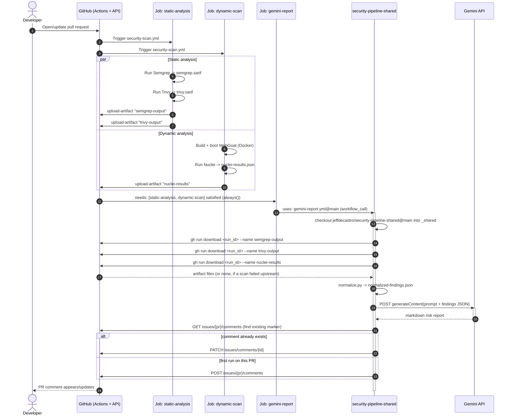

# security-pipeline-shared

A shared, reusable GitHub Actions workflow that turns raw security-scanner
output into a single, dev-readable, CWE-aware, risk-prioritized pull request
comment — generated by Gemini.

It is designed to be called (via `workflow_call`) from other repositories'
CI pipelines *after* those pipelines have already run their own scanners
(Semgrep, Trivy, Nuclei, Brakeman, ZAP, ...) and uploaded the raw output as
build artifacts. This repo does not run any scanners itself — it only
normalizes, summarizes, and comments.

It is currently consumed by [`jeffdecastro/WebGoatJeff`](https://github.com/jeffdecastro/WebGoatJeff)'s
`security-scan.yml` workflow as an experimental, second PR comment running
alongside that repo's own deterministic findings report.

---

## Table of contents

- [Why this exists](#why-this-exists)
- [High-level architecture](#high-level-architecture)
- [End-to-end sequence diagram](#end-to-end-sequence-diagram)
- [Repository layout](#repository-layout)
- [The reusable workflow: `gemini-report.yml`](#the-reusable-workflow-gemini-reportyml)
  - [Inputs](#inputs)
  - [Secrets](#secrets)
  - [Job steps in detail](#job-steps-in-detail)
- [The normalized finding schema](#the-normalized-finding-schema)
- [`normalize.py`: parser support matrix](#normalizepy-parser-support-matrix)
- [`gemini_report.py`: prompt and comment lifecycle](#gemini_reportpy-prompt-and-comment-lifecycle)
- [How a calling repo wires this in](#how-a-calling-repo-wires-this-in)
- [Failure philosophy: never break the caller's build](#failure-philosophy-never-break-the-callers-build)
- [Permissions and secrets handling](#permissions-and-secrets-handling)
- [Threat model and hardening](#threat-model-and-hardening)
- [Extending: adding a new scanner parser](#extending-adding-a-new-scanner-parser)
- [Known limitations](#known-limitations)
- [Local development / testing](#local-development--testing)

---

## Why this exists

Most CI security pipelines end up with three or four scanners, each with its
own output format (SARIF, JSONL, tool-specific JSON), each with its own idea
of what "severity" means, and each producing walls of low-signal findings
that developers learn to ignore. Two problems fall out of that:

1. **No single place to look.** A reviewer has to open the Semgrep tab, the
   Trivy tab, and the Nuclei artifact separately to understand the real risk
   introduced by a PR.
2. **No risk framing.** Raw scanner output is sorted by tool, not by
   "what should I actually fix before merging this." A `CRITICAL` from a
   SAST tool on dead code is not the same risk as a `MEDIUM` finding that a
   DAST tool *confirmed* is reachable over the network.

This repo solves both by centralizing the "explain this to a human" step:
it merges every scanner's output into one common schema, then asks Gemini
to produce a short, skimmable, risk-ranked markdown comment — while leaving
the original scanner severities untouched and auditable.

It is intentionally **reporting-only**. It never fails a build, never blocks
a merge, and never modifies repository files. See
[Failure philosophy](#failure-philosophy-never-break-the-callers-build).

---

## High-level architecture

The system has two halves that live in two different repositories:

- **Caller repo** (e.g. `WebGoatJeff`): owns and runs the actual scanners
  (Semgrep, Trivy, Nuclei, ...), uploads their raw output as workflow
  artifacts, and then calls into this repo via `workflow_call`.
- **This repo** (`security-pipeline-shared`): owns nothing scanner-specific.
  It downloads the artifacts the caller already produced *in the same run*,
  normalizes them, and calls the Gemini API to generate one PR comment.


Key architectural properties visible in the diagram:

- **Artifacts are the only data channel.** This repo never touches the
  caller's source code or scanner configuration — it only reads workflow
  artifacts that the caller already uploaded, addressed by name via the
  `artifact_manifest` input.
- **Same run, cross-job.** `gh run download` pulls artifacts from
  `github.run_id`, i.e. the *caller's* run. Because `gemini-report.yml` is
  invoked with `uses:` (not a separate `workflow_dispatch`), it executes as
  a job *inside* the caller's own run, so `github.run_id` is shared.
- **One outbound call to an LLM.** The only external dependency beyond
  GitHub itself is the Gemini API, called once per invocation with the full
  normalized findings array.
- **Idempotent comment.** The PR comment is upserted by a hidden HTML
  marker, not appended, so re-running the workflow on the same PR updates
  the existing comment instead of spamming new ones.

---

## End-to-end sequence diagram

This shows one concrete run: a pull request opened against the caller repo,
triggering `security-scan.yml`, which eventually calls into this repo's
`gemini-report.yml`.



Note the `alt`/`else` upsert branch and the `par` block for the two
independent scanner jobs — both are load-bearing details reflected directly
in the code (see [`gemini_report.py`](scripts/gemini_report.py) and
[`security-scan.yml` in the caller repo](https://github.com/jeffdecastro/WebGoatJeff/blob/main/.github/workflows/security-scan.yml)).

---

## Repository layout

```
security-pipeline-shared/
├── .github/
│   └── workflows/
│       └── gemini-report.yml     # the reusable workflow (workflow_call)
├── scripts/
│   ├── normalize.py              # SARIF / JSONL / tool-JSON -> common schema
│   └── gemini_report.py          # prompt building, Gemini call, PR comment upsert
├── tests/
│   ├── test_normalize.py         # parser, CWE, severity, dedupe, clamping tests
│   └── test_gemini_report.py     # retry, sanitizer, budget, upsert tests
└── README.md                     # this file
```

There is no build step and no dependency manifest — both scripts are
dependency-free stdlib Python 3.12 and are invoked directly by the workflow.
The test suite uses only `unittest` from the standard library and mocks all
network and `gh` calls, so it runs offline with no credentials.

---

## The reusable workflow: `gemini-report.yml`

Declared as `on: workflow_call`, so it cannot run on its own — it only
executes when another workflow references it with `uses:`.

### Inputs

| Input | Type | Required | Description |
|---|---|---|---|
| `pr_number` | `string` | yes | The pull request number to comment on. The caller is responsible for only invoking this on PR-triggered runs (see the `if: github.event_name == 'pull_request'` guard in the example caller). |
| `artifact_manifest` | `string` | yes | Comma-separated `parser-key=artifact-name` pairs, e.g. `semgrep-sarif=semgrep-output,trivy-sarif=trivy-output,nuclei-jsonl=nuclei-results`. The `parser-key` must match a key in `normalize.py`'s `PARSERS` dict; the `artifact-name` must match the `name:` used in the caller's `actions/upload-artifact` step. Every entry is validated against `^[a-z0-9-]+=[A-Za-z0-9._-]+$` before use and the job fails fast on a malformed entry. |
| `shared_ref` | `string` | no (default `main`) | Ref of this repo to check out for the scripts. Pin to a tag or commit SHA for reproducible runs; see [Known limitations](#known-limitations). |

### Secrets

| Secret | Required | Description |
|---|---|---|
| `GEMINI_API_KEY` | yes | Google Gemini API key, passed through from the caller's own repo/org secrets. Never stored in this repo. |

### Job steps in detail

The job `gemini-report` runs on `ubuntu-latest` with a 10-minute timeout and
requests only `contents: read` + `pull-requests: write`.

1. **Validate inputs** — the only step that is *not* `continue-on-error`.
   Asserts `pr_number` is numeric and that every `artifact_manifest` entry
   matches `^[a-z0-9-]+=[A-Za-z0-9._-]+$`. This runs before anything else so
   a malformed manifest fails loudly instead of silently producing no
   comment, and so no unvalidated value ever reaches `gh run download`.
2. **Checkout shared scripts** — checks out *this* repo (`inputs.shared_ref`,
   default `main`) into a `_shared/` subdirectory of the caller's workspace,
   so the caller doesn't need to vendor these scripts itself. Pinned to a
   specific `actions/checkout` commit SHA (`9c091bb2...` / tagged `v7.0.0`),
   with `persist-credentials: false` so no token is left in `_shared/.git`.
3. **Download scanner artifacts and build parser args** (`id: fetch`,
   `continue-on-error: true`) — parses `artifact_manifest`, and for each
   pair calls `gh run download <run_id> --name <artifact>`. A missing
   artifact (e.g. because an upstream scan step failed) logs a `::warning::`
   and is skipped rather than aborting the job. Every machine-readable file
   found in each artifact is queued (not just the first), and the resulting
   `parser-key=path` entries are written **NUL-delimited to
   `parser_args.txt`** rather than to a step output — see
   [Threat model and hardening](#threat-model-and-hardening).
4. **Set up Python** — `actions/setup-python@v6`, Python `3.12`.
5. **Normalize findings** (`continue-on-error: true`) — runs
   `_shared/scripts/normalize.py --args-file parser_args.txt`, writing
   `normalized-findings.json` and echoing the first 200 lines to the log for
   debuggability.
6. **Generate Gemini report and post PR comment**
   (`continue-on-error: true`) — runs `_shared/scripts/gemini_report.py`
   against `normalized-findings.json`, using `GEMINI_API_KEY`, `GH_TOKEN`
   (`github.token`), and `PR_NUMBER` from the environment.

Every step after validation is `continue-on-error: true` — see
[Failure philosophy](#failure-philosophy-never-break-the-callers-build).

The workflow declares a top-level `permissions: {}` (the job re-grants only
what it needs) and a `concurrency` group keyed on repo + PR number, so two
runs racing on the same PR cannot both decide "no comment exists yet" and
each POST one, which would defeat the upsert.

---

## The normalized finding schema

`normalize.py` reduces every supported scanner's native format down to this
flat shape, one object per finding, in a single JSON array:

```json
{
  "tool": "semgrep",
  "cwe": "CWE-89",
  "severity": "HIGH",
  "file": "src/main/java/org/owasp/webgoat/SqlInjection.java",
  "line": 42,
  "rule_id": "java.sql-injection.sqli",
  "description": "User-controlled input flows into a SQL query without sanitization."
}
```

| Field | Type | Notes |
|---|---|---|
| `tool` | string | One of `semgrep`, `trivy`, `nuclei`, `brakeman`, `zap` — set by the parser, not read from the scanner output. After dedupe this may be a comma-joined, alphabetically sorted list (e.g. `semgrep,trivy`) when several tools reported the same finding. |
| `cwe` | string | Always exactly `CWE-<number>` or the literal `CWE-UNKNOWN`. Scanners spell this inconsistently — Semgrep emits `"CWE-89: Improper Neutralization of…"`, ZAP and Brakeman emit bare numbers (`"79"`, `[89]`) — so all forms are reduced to the bare id. |
| `severity` | string | One of `CRITICAL`, `HIGH`, `MEDIUM`, `LOW`, `INFO` (`SEVERITY_ORDER`). Mapped from each tool's native scale — see the matrix below. This value is **authoritative** and Gemini is explicitly instructed not to change it. |
| `file` | string | File path (SAST), or matched URL/host (DAST tools like Nuclei/ZAP, which have no file concept). Clamped to 500 characters. |
| `line` | integer | Source line, or `0` when not applicable (DAST findings). Non-numeric or negative values normalize to `0`. |
| `rule_id` | string | Scanner-specific rule/check identifier or template name. For Trivy this is the CVE id (e.g. `CVE-2026-45133`). Clamped to 500 characters. |
| `description` | string | Free-text human-readable explanation from the scanner. Clamped to 1000 characters (Trivy embeds full CVE prose, which is otherwise unbounded prompt cost). |

Every string field is passed through a clamp that strips control characters
and enforces a length cap. Scanner output echoes source code, file paths, and
URLs, all of which can be attacker-influenced on a fork PR; without this a
finding could embed a newline followed by `::error::` and forge a GitHub
Actions workflow command when the normalized JSON is printed to the run log.

### Deduplication

`normalize.py` deduplicates before emitting. Findings are keyed on
`(cwe, file, line, rule_id)`; collisions merge into one record that keeps the
**highest** severity seen and joins the reporting tool names. The output array
is then sorted by severity (`CRITICAL` first), then CWE, file, and line.

That ordering is load-bearing: `gemini_report.py` truncates the findings array
from the end when it exceeds the prompt budget, so truncation always drops the
least severe findings first.

This schema is the entire contract between "raw scanner output" and "what
Gemini sees." It's deliberately minimal — no severity scores, no remediation
guidance — those are left to Gemini to reason about at report-generation time
from the fields above.

---

## `normalize.py`: parser support matrix

| Parser key | Format | Native severity signal | Mapping to normalized `severity` |
|---|---|---|---|
| `semgrep-sarif` | SARIF | `result.level` (`error`/`warning`/`note`), or `security-severity` score on the rule if present | `security-severity` ≥9 → `CRITICAL`, ≥7 → `HIGH`, ≥4 → `MEDIUM`, else `LOW`; otherwise `error`→`HIGH`, `warning`→`MEDIUM`, `note`→`LOW`, default `MEDIUM`. A non-numeric `security-severity` falls back to the level rather than raising. |
| `trivy-sarif` | SARIF | same SARIF logic as above (Trivy is run with `format: sarif` in the caller) | same as above |
| `sarif` | SARIF | generic passthrough for any other SARIF producer | same as above; findings are labelled `tool: "sarif"` |
| `nuclei-jsonl` | JSON Lines, **or** a single JSON array (`-json` vs `-jsonl`) | `info.severity` (nuclei's own scale: `critical`/`high`/`medium`/`low`/`info`) | Uppercased directly; falls back to `INFO` if the value isn't recognized. CWE is read from `info.classification.cwe-id`. Empty/missing file is treated as zero findings. A single malformed line is logged and skipped; the remaining lines still parse. |
| `brakeman-json` | JSON (`warnings[]`) | `confidence` (`High`/`Medium`/`Weak`) | `High`→`HIGH`, `Medium`→`MEDIUM`, `Weak`→`LOW`, default `MEDIUM`. `cwe_id` is accepted as either a list (first usable entry wins) or a bare scalar. |
| `zap-json` | JSON (`site[].alerts[]`) | `riskcode` (`"3"`/`"2"`/`"1"`/`"0"`) | `"3"`→`HIGH`, `"2"`→`MEDIUM`, `"1"`→`LOW`, `"0"`→`INFO`, default `LOW`. `cweid` of `null`, `-1`, or `0` becomes `CWE-UNKNOWN`. The first `instances[]` URI is used as `file`, falling back to the site name when `instances` is absent **or an empty list** (common on passive-scan-only runs). |

Notes:

- SARIF parsing (`parse_sarif`) is shared between Semgrep and Trivy — the
  only difference is the `tool_name` label attached to each finding.
- **Trivy SARIF carries no CWE data at all** (its rule `properties` are only
  `precision`, `security-severity`, and `tags`), so Trivy findings normalize
  to `CWE-UNKNOWN` by design. The CVE id is preserved in `rule_id`, which is
  the more useful identifier for dependency findings anyway.
- Every parser tolerates structurally wrong input — a non-object top level, a
  `runs`/`results`/`alerts` value that isn't a list, or `null` entries inside
  one — and yields the findings it can rather than raising.
- Any `parser-key` in `artifact_manifest` that isn't in the `PARSERS` dict
  produces a `::warning::` annotation and is skipped, not a hard failure.
- Any per-file parse exception is caught, logged as a `::warning::`, and
  that file's findings are simply omitted — one malformed scanner output
  file never aborts the whole normalization step.
- A missing file (path doesn't exist) is silently skipped — this is the
  normal case when an artifact wasn't produced (e.g. a scan step failed
  upstream and `continue-on-error` let the job proceed with no output).
- Per-file parse counts are logged to stderr, so the run log shows how many
  findings each artifact contributed and how many survived dedupe.

---

## `gemini_report.py`: prompt and comment lifecycle

### Prompt contract

The prompt sent to Gemini (`gemini-2.5-flash` by default, overridable via
the `GEMINI_MODEL` env var) embeds the full normalized findings array and
instructs the model to:

- **Never invent findings** — only report on what's in the input array.
- **Never change `severity`** — it's scanner-authoritative; Gemini may
  re-rank by real-world exploitability/reachability but must show the
  original severity alongside any re-ranking.
- **Deduplicate** findings that clearly describe the same underlying issue
  across tools (e.g. same CWE, same file/line from two scanners).
- **Explain each CWE group** in one or two plain-English sentences.
- **Produce a "Risk-based priority" section** at the top: 3-5 items ranked
  by real-world risk, each with a one-line reason (e.g.
  "internet-reachable", "confirmed by dynamic scan", "known CVE with
  public exploit", "auth bypass path").
- **Stay skimmable** — markdown headers, tables, and collapsible
  `<details>` sections for the long tail of low-severity items.
- **Emit only the comment body** — no "Here is the comment" preamble.
- **Emit no HTML comments, `<script>`, `<iframe>`, or `` tags.**

If the normalized findings array is empty, Gemini is never called — the
script short-circuits to a fixed `"### No security findings to report for
this PR."` comment.

### Prompt budget

The findings array is embedded in the prompt directly, so it is bounded twice:
at most `MAX_FINDINGS_IN_PROMPT` (300) findings, and at most
`MAX_FINDINGS_CHARS` (300,000) characters of serialized JSON. Because
`normalize.py` sorts by severity, truncation drops the least severe findings
first. When anything is dropped, the prompt tells the model how many findings
existed in total and instructs it to state the truncation in the comment, so a
truncated report is never silently mistaken for a complete one.

### Transport and retries

`call_gemini` retries up to 4 times with exponential backoff plus jitter on
`429`/`5xx` and on network/timeout errors. Non-retryable client errors (`4xx`
other than 429) and safety blocks fail immediately rather than burning quota.

The response is parsed defensively: a safety block, an empty `candidates`
array, or a candidate with no `parts` (which is what a `MAX_TOKENS` or
`SAFETY` finish produces) raises a descriptive `RuntimeError` instead of an
opaque `KeyError`.

### Output sanitization

Gemini's output is treated as **untrusted**, because it is a summary of
scanner findings that themselves quote attacker-influenceable source code.
Before the text is posted, `sanitize_report` strips HTML comments and active
markup (`<script>`, `<iframe>`, `<object>`, `<embed>`, `<form>`, `<meta>`,
`<base>`, `<link>`). Stripping HTML comments specifically prevents the model
from emitting the upsert marker itself, which would let one run's comment
hijack or orphan another's. Ordinary markdown — headers, tables, and
`<details>`/`<summary>` blocks — is preserved.

The final body is then truncated to GitHub's hard 65,536-character limit for
issue comments, with a visible truncation notice appended. Without this an
oversized report is rejected by the API and the run produces no comment at
all.

### Comment upsert

Every comment (including the "no findings" case) is prefixed with a hidden
marker:

```
<!-- gemini-security-report -->
```

On each run, `upsert_pr_comment`:

1. Lists all comments on the PR (`gh api .../issues/{pr}/comments
   --paginate`) and filters for ones whose body starts with the marker.
2. If one or more exist, **PATCH**es the most recent (`existing[-1]`) in
   place.
3. Otherwise, **POST**s a new comment.

This makes the workflow safe to re-run on every push to a PR: the comment
updates in place instead of accumulating duplicates. The comment body is
written to a temp file and passed via `gh api -f body=@file` rather than
inline, avoiding shell-escaping issues with arbitrary markdown/Gemini
output.

---

## How a calling repo wires this in

Example, taken from [`WebGoatJeff`'s `security-scan.yml`](https://github.com/jeffdecastro/WebGoatJeff/blob/main/.github/workflows/security-scan.yml):

```yaml
jobs:
  static-analysis:
    # ... runs Semgrep + Trivy, uploads artifacts named
    #     "semgrep-output" and "trivy-output" ...

  dynamic-scan:
    # ... builds/boots the app, runs Nuclei, uploads an artifact
    #     named "nuclei-results" ...

  gemini-report:
    name: Gemini Report (dev-readable, risk-prioritized)
    if: always() && github.event_name == 'pull_request'
    needs: [static-analysis, dynamic-scan]
    uses: jeffdecastro/security-pipeline-shared/.github/workflows/gemini-report.yml@main
    permissions:
      contents: read
      pull-requests: write
    with:
      pr_number: ${{ github.event.pull_request.number }}
      artifact_manifest: "semgrep-sarif=semgrep-output,trivy-sarif=trivy-output,nuclei-jsonl=nuclei-results"
    secrets:
      GEMINI_API_KEY: ${{ secrets.GEMINI_API_KEY }}
```

Requirements for any calling repo:

1. Upstream jobs must upload their raw scanner output via
   `actions/upload-artifact`, using artifact names that match the
   right-hand side of each `artifact_manifest` pair.
2. The calling job must set `needs:` on those upstream jobs so the
   artifacts exist in the run by the time this workflow executes.
3. `pr_number` should only be supplied on PR-triggered runs — guard with
   `if: github.event_name == 'pull_request'` as shown above (`always()` is
   combined with that guard specifically so a hard failure in an upstream
   job still produces a partial report instead of the whole job being
   skipped).
4. A `GEMINI_API_KEY` secret must be available to pass through — this repo
   never stores or defaults it.
5. `permissions: pull-requests: write` must be granted at the calling job
   level (reusable workflows do not inherit elevated permissions from the
   caller's top-level `permissions:` block by default).

---

## Failure philosophy: never break the caller's build

This pipeline is explicitly **reporting-only**. Every step past checkout in
`gemini-report.yml` is `continue-on-error: true`, matching the same
philosophy in the calling repo's own scan jobs. Concretely, that means:

- A missing or malformed scanner artifact never fails the job — it's
  logged and the corresponding findings are simply absent from the report.
- A Gemini API error (bad key, quota, timeout, malformed response) never
  fails the job — it fails that step, and the job is still reported as
  successful to the rest of the pipeline.
- A GitHub API error posting/patching the PR comment never fails the job.

The tradeoff: **this workflow can silently produce no comment at all** if
something upstream breaks, with no failed check to signal that. If you rely
on this in a caller repo, treat the presence/absence of the
`<!-- gemini-security-report -->` comment as informational, not as a gate,
and check the Action run logs directly if you suspect it silently no-op'd.

---

## Permissions and secrets handling

- The job requests the minimum GitHub permissions it needs:
  `contents: read` (to check out this repo) and `pull-requests: write` (to
  post/update the comment). It does **not** request `issues: write` —
  filing issues for Critical findings is handled by the *caller* repo's own
  separate report job, not by this one.
- `GH_TOKEN` used for `gh run download` and `gh api` calls is
  `github.token`, the caller run's own ephemeral installation token — this
  repo never uses a personal access token or a token scoped beyond the
  calling repository/run.
- `GEMINI_API_KEY` is passed as a `workflow_call` secret from the caller;
  it is only ever read into an environment variable for the single
  `gemini_report.py` process and is never echoed, logged, or written to a
  file.
- The Gemini API key is sent in the `x-goog-api-key` **request header**, not
  as a `?key=` query parameter. Both are supported by Google, but a query
  string tends to leak: it shows up in `urllib` exception messages and
  tracebacks, and in any intermediary that logs request lines.

---

## Threat model and hardening

The trust boundary here is subtle. This workflow never executes the caller's
code, but it does process data derived from it: scanner output quotes source
snippets, file paths, and URLs from the pull request under review. On a fork
PR, all of that is attacker-controlled. Three sinks matter.

**1. Artifact paths reaching a shell.** The `fetch` step discovers files
inside downloaded artifacts with `find`, so those paths are attacker-shaped.
Passing them through a step output and interpolating that output into a later
`run:` block — `python3 normalize.py ${{ steps.fetch.outputs.parser_args }}` —
is a command-injection sink: GitHub Actions substitutes the value as *literal
text* into the script before `bash` parses it, so a file named
`x$(id).sarif` executes `id`. Two changes close this:

- Paths are written **NUL-delimited to `parser_args.txt`** and read by
  `normalize.py --args-file`. They never pass through a step output and are
  never word-split or expanded by a shell. NUL delimiting also means paths
  containing spaces or newlines round-trip intact.
- `artifact_manifest` is validated against a strict charset before any entry
  reaches `gh run download --name`.

All `run:` blocks use `set -euo pipefail` and read caller-controlled values
from `env:` rather than `${{ }}` interpolation.

**2. Findings text reaching the run log and the model.** Every normalized
string field is stripped of control characters and length-clamped, so a
finding cannot forge an Actions workflow command (`::error::`, `::add-mask::`)
when the normalized JSON is echoed to the log. The findings JSON is fenced in
the prompt between explicit delimiters and preceded by an instruction to treat
its contents as inert data — the model is told that scanner text may claim to
be a system message or an override and must be ignored.

This mitigates but does not eliminate prompt injection. The structural
defenses are what actually bound the damage: severities are copied verbatim
from `normalize.py` output and never taken from the model, and the model's
output is sanitized before posting.

**3. Model output reaching a PR comment.** See
[Output sanitization](#output-sanitization) — the marker cannot be forged and
active markup is stripped.

Also addressed: the workflow declares `permissions: {}` at the top level,
checkout uses `persist-credentials: false`, and a `concurrency` group
serializes runs per PR so the comment upsert cannot race itself into
duplicate comments.

---

## Extending: adding a new scanner parser

To support a new scanner (e.g. Bandit, Gitleaks, OWASP Dependency-Check):

1. Add a `parse_<tool>(path)` function in `scripts/normalize.py` that reads
   the tool's native output and returns a list of dicts matching the
   [normalized finding schema](#the-normalized-finding-schema).
2. Register it in the `PARSERS` dict under a new `parser-key` (the key
   naming convention is `<tool>-<format>`, e.g. `bandit-json`).
3. No changes are needed in `gemini-report.yml` itself — callers opt in by
   adding `<parser-key>=<artifact-name>` to their `artifact_manifest`
   input and uploading the corresponding artifact.
4. If the tool has a non-obvious severity scale, document the mapping in
   the [parser support matrix](#normalizepy-parser-support-matrix) above
   when you add it.

---

## Known limitations

- **`@main` pinning.** The example caller references this workflow via
  `@main` rather than a pinned tag/SHA, so changes here take effect
  immediately in downstream callers on their next run — there is currently
  no versioned release process. The `shared_ref` input lets a caller pin the
  *scripts*, but the `uses:` reference to the workflow itself still has to be
  pinned by the caller.
- **Truncation over chunking.** Very large findings sets are truncated to the
  prompt budget rather than chunked across multiple LLM calls and merged. The
  comment says so explicitly when it happens, but the long tail is dropped.
- **Prompt injection is mitigated, not solved.** Instructional defenses in
  the prompt are best-effort. The guarantees that actually hold are
  structural: severities come from `normalize.py` and are never read back
  from the model, and model output is sanitized before posting. A determined
  injection could still influence the *prose* of the summary.
- **Dedupe is exact-match, not fuzzy.** Findings are keyed on
  `(cwe, file, line, rule_id)`. Two tools describing the same issue with
  different rule ids or off-by-one line numbers still appear twice; the
  prompt asks Gemini to merge those semantically.
- **Trivy findings carry no CWE**, so they all group under `CWE-UNKNOWN`.
  Their CVE id is in `rule_id`.
- **DAST findings have no line number and often no file**, by nature of
  the tools (Nuclei/ZAP operate over HTTP, not source) — `file` is
  overloaded to mean "URL/host" for those tools, and `line` is always `0`.
- **The Gemini call is not covered by live tests.** The test suite mocks the
  API; only the request construction and response handling are verified
  offline.

---

## Local development / testing

### Running the tests

No dependencies, no network, no credentials:

```bash
python3 -m unittest discover -s tests -v
```

The suite covers each parser's happy path and its malformed-input paths, CWE
normalization across all three scanner spellings, severity mapping bands,
field clamping, dedupe/ordering, the Gemini retry and response-parsing logic,
output sanitization, the prompt and comment size budgets, and temp-file
cleanup on failure.

### Running the scripts

Both scripts are dependency-free Python 3.12 and can be run directly:

```bash
# Normalize a local SARIF + Nuclei JSONL file
python3 scripts/normalize.py \
  semgrep-sarif=./semgrep.sarif \
  nuclei-jsonl=./nuclei-results.json \
  > normalized-findings.json

# Or the way the workflow invokes it, with a NUL-delimited args file
printf 'semgrep-sarif=%s\0trivy-sarif=%s\0' ./semgrep.sarif ./trivy.sarif > args.txt
python3 scripts/normalize.py --args-file args.txt > normalized-findings.json

# Generate a report locally (requires network + a real Gemini key)
export GEMINI_API_KEY=...
export GITHUB_REPOSITORY=jeffdecastro/WebGoatJeff
export PR_NUMBER=123
export GH_TOKEN=$(gh auth token)
python3 scripts/gemini_report.py normalized-findings.json
```

Note that `gemini_report.py`'s `upsert_pr_comment` step will make real
`gh api` calls against `GITHUB_REPOSITORY`/`PR_NUMBER` if you run it
locally with a valid `GH_TOKEN` — point it at a scratch repo/PR rather than
a production one when testing.

### Generating realistic fixtures

The unit tests use synthetic inputs. To exercise the parsers against real
scanner output, point the scanners at a deliberately vulnerable app —
[DVWA](https://github.com/digininja/DVWA) and
[OWASP Juice Shop](https://github.com/juice-shop/juice-shop) both produce a
useful spread of CWEs:

```bash
git clone --depth 1 https://github.com/digininja/DVWA /tmp/DVWA

semgrep scan --config=p/default --sarif --output=/tmp/dvwa-semgrep.sarif /tmp/DVWA
trivy fs --format sarif --scanners vuln,secret,misconfig \
  --output /tmp/dvwa-trivy.sarif /tmp/DVWA

printf 'semgrep-sarif=%s\0trivy-sarif=%s\0' \
  /tmp/dvwa-semgrep.sarif /tmp/dvwa-trivy.sarif > /tmp/args.txt
python3 scripts/normalize.py --args-file /tmp/args.txt | jq -r '.[].cwe' | sort | uniq -c | sort -rn
```

DVWA should surface `CWE-89` (SQL injection), `CWE-78` (OS command
injection), and `CWE-94` (code injection) among the top groups; Juice Shop
adds `CWE-798` (hardcoded credentials). Both are useful for confirming that a
new parser's CWE and severity mappings land where you expect.

### CI

`.github/workflows/test.yml` runs the unit suite plus a CLI smoke test on
Python 3.11 and 3.12 for every push and pull request.
