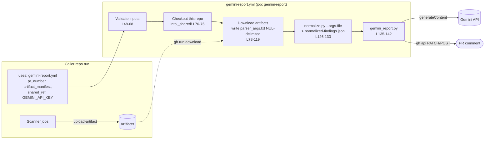

# Capabilities map: security-pipeline-shared

Written at commit `ae4c89d` (2026-07-20) on branch `claude/intelligent-clarke-ibv0u6`.
Every claim cites a file and line. Anything marked **(inferred)** was reasoned
from the code but not run or confirmed. The test suite was run locally:
62 tests pass on Python 3.11.15 (`python3 -m unittest discover -s tests`).

---

## 1. Purpose

A shared **GitHub Actions reusable workflow** (`workflow_call`) that other
repositories call after their own security scanners have run. It downloads the
scanner output those callers uploaded as artifacts, turns it into one common
finding schema, asks Google Gemini for a risk-ranked summary, and upserts a
single PR comment. That comment has two parts: the model's narrative and a
complete finding inventory generated in code (`README.md:3-16`,
`.github/workflows/gemini-report.yml:3-7`). It only reports. It never runs
scanners, never fails the caller's build, and never modifies the caller's
repository (`README.md:66-68`). Known callers: `jeffdecastro/DVWA`
(`README.md:18-20`) and `jeffdecastro/WebGoatJeff` (`README.md:497`).

## 2. Tech stack

| Area | What | Evidence |
|---|---|---|
| Language | Python 3 (pinned to 3.12 in the workflow; CI also tests 3.11), stdlib only | `gemini-report.yml:121-124`, `test.yml:166`, `README.md:241-243` |
| Dependencies | None. No `requirements.txt`, `pyproject.toml`, or lockfile. Uses `json`, `re`, `urllib.request`, `subprocess`, `tempfile`, `pathlib` | `scripts/normalize.py:3-6`, `scripts/gemini_report.py:3-12` |
| Orchestration | GitHub Actions: one reusable workflow and one CI workflow | `.github/workflows/gemini-report.yml`, `.github/workflows/test.yml` |
| Pinned actions | `actions/checkout@9c091bb…` (v7.0.0), `actions/setup-python@e797f83…` (v6.0.0), both pinned to a SHA | `gemini-report.yml:71,122` |
| CLI tools on runner | `gh` (for `gh run download` and `gh api`), `find`, `sort`, bash | `gemini-report.yml:100,112`, `gemini_report.py:256-260` |
| External APIs | Gemini `generativelanguage.googleapis.com/v1beta/models/{MODEL}:generateContent`; GitHub REST (artifacts, issue comments) | `gemini_report.py:15-16,266-284` |
| LLM model | `gemini-flash-latest`, overridable with the `GEMINI_MODEL` env var | `gemini_report.py:15` |
| Datastores | None. State lives only in files in the job workspace (`parser_args.txt`, `normalized-findings.json`) and in the PR comment | `gemini-report.yml:91,131` |
| Supported scanner formats | SARIF (Semgrep, Trivy, generic), Nuclei JSONL or JSON array, Brakeman JSON, ZAP JSON | `normalize.py:231-238` |

## 3. Architecture overview

There are three components, connected by files. Each step's output is the next
step's input.



**Data flow:**

1. **Input contract.** `artifact_manifest` is `parser-key=artifact-name,...`.
   Each entry is validated against `^[a-z0-9-]+=[A-Za-z0-9._-]+$`
   (`gemini-report.yml:61-67`).
2. **Fetch.** For each pair, `gh run download $RUN_ID --name $artifact`, then
   `find` locates `*.json|*.sarif|*.jsonl`. Each match is written as
   `key=path\0` to `parser_args.txt` (`gemini-report.yml:93-119`).
3. **Normalize** (`normalize.py`). `main()` reads the args file
   (`normalize.py:279-293`), looks up each key in `PARSERS`
   (`normalize.py:301`), and calls the parser. Each parser produces dicts
   through `_finding()`, which clamps and cleans every field
   (`normalize.py:86-97`). Then `dedupe()` merges findings on
   `(cwe, file, line, rule_id)` and sorts by severity (`normalize.py:241-265`).
   The result is a JSON array on stdout.
4. **Report** (`gemini_report.py:main`, L310-368). The steps are:
   `load_findings` → if empty, post "No security findings"
   → `build_appendix` (the deterministic inventory)
   → `build_prompt` (capped at 300 findings / 300k chars)
   → `call_gemini` (retries with backoff) → `sanitize_report`
   → `compose_body` (keeps the appendix and trims the narrative when too long)
   → `upsert_pr_comment` (finds the existing comment by
   `<!-- gemini-security-report -->`, then PATCHes it or POSTs a new one).
5. **Failure posture.** Every step after checkout is `continue-on-error: true`
   (`gemini-report.yml:80,127,136`). `gemini_report.py` exits 1 when the
   narrative failed but the inventory was still posted (`gemini_report.py:338-368`).

**Finding schema** (the only contract between the two scripts):
`{tool, cwe, severity, file, line, rule_id, description}`
(`normalize.py:89-97`; test `test_schema_keys_are_stable`, `tests/test_normalize.py:244-248`).
Severity is one of `CRITICAL|HIGH|MEDIUM|LOW|INFO` (`normalize.py:8`). CWE is
`CWE-<n>` or `CWE-UNKNOWN`. After dedupe, `tool` may be a comma-joined list
(`normalize.py:261-262`).

## 4. Current capabilities

| Capability | Description | Entry point | Key files | Test coverage |
|---|---|---|---|---|
| Reusable workflow entry | `workflow_call` with `pr_number`, `artifact_manifest`, `shared_ref`, and secret `GEMINI_API_KEY` | `gemini-report.yml:9-30` | `.github/workflows/gemini-report.yml` | none (not exercised in CI; validated live per `README.md:769-782`) |
| Input validation | Numeric PR number and a strict charset for the manifest; fails the job fast | `gemini-report.yml:48-68` | same | none |
| Artifact fetch + file discovery | Downloads named artifacts from the same run. Prefers machine-readable files and queues every match | `gemini-report.yml:78-119` | same | none |
| SARIF parsing (semgrep / trivy / generic) | Reads CWE from tags or `cwe_id`. Severity comes from `security-severity` bands or `level` | `PARSERS["semgrep-sarif"\|"trivy-sarif"\|"sarif"]` | `normalize.py:68-83,111-145` | yes (`TestSarifParser`, `TestSeverityMapping`) |
| Nuclei parsing | Accepts JSONL or a JSON array. Skips malformed lines instead of failing the file | `PARSERS["nuclei-jsonl"]` | `normalize.py:148-187` | yes (`TestNucleiParser`) |
| Brakeman parsing | Maps confidence to severity. `cwe_id` can be a list or a scalar | `PARSERS["brakeman-json"]` | `normalize.py:190-204` | yes (`TestBrakemanParser`, one test) |
| ZAP parsing | Maps `riskcode` to severity. Falls back to the site name when `instances[]` is empty | `PARSERS["zap-json"]` | `normalize.py:207-228` | yes (`TestZapParser`) |
| CWE normalization | Handles prose tags, bare numbers, and `cwe_79` spellings | `_normalize_cwe` | `normalize.py:43-65` | yes (`TestCweNormalization`) |
| Field sanitizing / clamping | Strips control characters. Limits: 500 chars per field, 1000 for description | `_clean`, `_finding` | `normalize.py:19-40,86-97` | yes (`TestFieldClamping`) |
| Dedupe + severity ordering | Exact-key merge that keeps the max severity and joins tool names | `dedupe` | `normalize.py:241-265` | yes (`TestDedupeAndOrdering`) |
| NUL-delimited args file | Keeps paths safe to pass without shell injection | `normalize.py --args-file` | `normalize.py:268-293` | yes for `read_args_file` (`TestArgsFile`). `main()` is covered only by the CI smoke test (`test.yml:179-198`) |
| Prompt building with budget | Caps findings, fences them between delimiters, and adds a truncation note | `build_prompt` | `gemini_report.py:33-86` | yes (`TestPromptBudget`) |
| Gemini call with retry | Retries 429/5xx and network errors up to 4 times. Sends the key as a header | `call_gemini` | `gemini_report.py:113-148` | yes, mocked (`TestRetry`, `TestExtractText`) |
| Output sanitization | Strips HTML comments and active tags from the model text | `sanitize_report` | `gemini_report.py:151-161` | yes (`TestSanitize`) |
| Generated inventory | Code-built counts by severity and tool plus the full table, with a 30k-char budget | `build_appendix` | `gemini_report.py:169-227` | yes (`TestAppendix`) |
| Comment size management | Trims the narrative first to stay under GitHub's 65,536-char limit | `compose_body`, `truncate_for_github` | `gemini_report.py:230-253` | yes (`TestComposeBody`, `TestGithubLimits`) |
| PR comment upsert | Finds the comment by marker, then PATCHes the latest one or POSTs a new one. Body goes through a temp file | `upsert_pr_comment` | `gemini_report.py:256-291` | yes, mocked (`TestUpsert`) |
| Degraded modes | A missing key or a failed API call still posts the inventory and exits 1 | `main` | `gemini_report.py:331-368` | yes (`TestMain`) |
| Per-PR serialization | A `concurrency` group keyed on repo + PR | `gemini-report.yml:34-38` | same | none |
| CI | Unit tests plus a CLI smoke test on Python 3.11 and 3.12 | `test.yml` | `.github/workflows/test.yml` | n/a |

## 5. Extension points and patterns

### 5.1 Registration and wiring

| Extension point | Where | How it's wired |
|---|---|---|
| **Scanner parser registry** (primary) | `PARSERS` dict, `normalize.py:231-238` | Map `"<tool>-<format>"` to `callable(path) -> list[finding]`. `main()` dispatches on the key (`normalize.py:301`). Callers opt in through `artifact_manifest` with no workflow change (`README.md:640-643`). Unknown keys produce a warning, not an error (`normalize.py:302-304`). |
| **Workflow inputs** | `on.workflow_call.inputs`/`secrets`, `gemini-report.yml:10-30` | Add an input. Validate it in the "Validate inputs" step (`L48-68`). Pass it to scripts **only through `env:`**, never as `${{ }}` inside `run:` (`README.md:596-597`). Example: `inputs.pr_number` → `env.PR_NUMBER` (`L50,140`). |
| **Report pipeline stages** | `gemini_report.main()`, `gemini_report.py:310-368` | A linear pipeline of pure functions. New deterministic output sections follow `build_appendix` (pure `findings -> str`, called at L336, joined in `compose_body` L237-253). New output sinks would sit next to `upsert_pr_comment` (L363). |
| **Prompt / model config** | `PROMPT_TEMPLATE` L33-56, `MODEL` L15, budget constants L20-31 | Env var `GEMINI_MODEL` (not currently exposed as a workflow input). The generation config is hard-coded at L114-117. |
| **Workflow steps** | `gemini-report.yml` `steps:` | New stages are added as steps that pass files through the workspace (`parser_args.txt` → `normalized-findings.json`). Each new step should use `continue-on-error: true` and `set -euo pipefail`. |
| **CI** | `test.yml` | `unittest discover` picks up any `tests/test_*.py` automatically (`test.yml:177`). |

There is no DI container, plugin loader, or config file. Registration happens
through dicts and function calls in the scripts themselves.

### 5.2 Best example to copy: `parse_zap` and `TestZapParser`

`parse_zap` (`normalize.py:207-228`) is the most complete example of the
parser pattern. It:

- loads with `_load_json` (which rejects a non-object top level, L100-104);
- iterates only through `_as_list(...)` and skips entries that aren't dicts (L211-216);
- maps a native severity scale through a dict, with a default (L210, L225);
- normalizes the CWE, including sentinel values (L222-223);
- falls back when an optional structure is missing or empty (L217-221);
- builds every record through `_finding()`, so clamping, cleaning, and severity
  validation happen in one place (L224-227).

Its tests (`tests/test_normalize.py:145-173`) show the expected test shape:
a happy path, the degenerate empty-list input, and the full severity-band mapping.
All of them use the `write(tmpdir, name, content)` fixture helper (`tests/test_normalize.py:14-17`).
For a **SARIF-based** tool, don't write a parser. Add a one-line lambda around
`parse_sarif` (`normalize.py:232-234`).

For a **report-side** capability (for example, a new comment section), model on
`build_appendix` and `TestAppendix` (`gemini_report.py:169-227`,
`tests/test_gemini_report.py:170-230`). It is a pure function, budgets its own
length, escapes table cells with `_cell`, and stays complete no matter what the
model outputs.

### 5.3 Where new things go

| Kind | Location |
|---|---|
| Parser code | `scripts/normalize.py`, a new `parse_<tool>` function plus a `PARSERS` entry |
| Report / output code | `scripts/gemini_report.py` (or a new script in `scripts/` invoked by a new workflow step) |
| Tests | `tests/test_normalize.py` / `tests/test_gemini_report.py`, one `TestCase` class per unit. New files must be named `tests/test_*.py` |
| Workflow inputs / steps | `.github/workflows/gemini-report.yml` |
| CLI smoke assertions | `.github/workflows/test.yml:179-198` |
| Docs | `README.md`: parser support matrix (L352-380), Inputs table (L260-266), Extending (L630-647), Known limitations (L651) |

## 6. Conventions

- **Naming.** `snake_case`. Private helpers start with `_` (`_clean`,
  `_finding`, `_gh`). Module-level constants are `UPPER_CASE` with a comment
  explaining why that value was chosen (`gemini_report.py:18-31`). Parser keys
  follow `<tool>-<format>` (`README.md:638-639`).
- **Comments.** Comments explain *why*, often citing a real incident
  (`normalize.py:11-12,25-27`, `gemini_report.py:172-177,341-345`). Every
  function has a short docstring when its behavior isn't obvious.
- **Error handling.** Fail soft. Bad input yields fewer findings, not a crash.
  Parsers tolerate wrong types (`_as_list`, `isinstance` checks). `main()`
  catches each file's parse failure and continues (`normalize.py:307-311`).
  Deterministic errors (such as a safety block) are raised without retry
  (`gemini_report.py:139-141`). Only input validation fails hard.
- **Logging.** Everything goes to **stderr**. Stdout carries data only
  (`normalize.py` prints JSON to stdout, L317). Messages use Actions
  annotations `::warning::` / `::error::` (`normalize.py:161,173,292,299,303,310`,
  `gemini_report.py:145,299-306,317`). `gemini_report.log()` wraps stderr (L59-60).
- **Config / secrets.** Configuration comes only from env vars
  (`GEMINI_API_KEY`, `GEMINI_MODEL`, `GITHUB_REPOSITORY`, `PR_NUMBER`,
  `GH_TOKEN`). No config files. Secrets are never logged, and the API key goes
  in the `x-goog-api-key` header (`gemini_report.py:124-126`).
- **Input validation.** Done twice: in bash in the workflow
  (`gemini-report.yml:54-67`) and again in Python (`gemini_report.py:315-327`).
  Scanner data is passed through `_clean` (normalize) and `_cell` (appendix).
- **Auth/authz.** Uses the caller run's `github.token`. Permissions are
  `permissions: {}` at the top level and `contents: read` +
  `pull-requests: write` at the job level (`gemini-report.yml:32,44-46`).
- **Testing style.** Stdlib `unittest` plus `unittest.mock`. Each test file
  prepends `scripts/` to `sys.path` (`tests/test_normalize.py:9`). All
  network and `gh` access is mocked (`mock.patch.object(gr, "_gh")`,
  `FakeResponse`, `http_error`, `tests/test_gemini_report.py:23-38`). Test
  docstrings and comments record the regression each test guards.
- **Lint/format.** There is **no** linter, formatter, or type checker configured
  (no config files, and no lint step in `test.yml`). The code uses `# noqa: E402`
  on test imports (`tests/test_normalize.py:11`), which suggests flake8/ruff is
  used informally **(inferred)**. Lines run to roughly 110 characters.

## 7. Build, run, and test

There is nothing to install. You need Python 3.11+ and, for the report step, `gh`.

```bash
# Unit tests (offline, no credentials)
python3 -m unittest discover -s tests -v

# Normalize local scanner output
python3 scripts/normalize.py semgrep-sarif=./semgrep.sarif nuclei-jsonl=./nuclei.jsonl > normalized-findings.json
# ...or the way the workflow does it
printf 'semgrep-sarif=%s\0' ./semgrep.sarif > args.txt
python3 scripts/normalize.py --args-file args.txt > normalized-findings.json

# Generate and POST a real PR comment (network, real key, real gh token)
GEMINI_API_KEY=... GITHUB_REPOSITORY=owner/repo PR_NUMBER=123 GH_TOKEN=$(gh auth token) \
  python3 scripts/gemini_report.py normalized-findings.json
```

(Sources: `README.md:704-736`, `test.yml:177-198`.) Running `gemini_report.py`
with a valid token writes a real comment, so use a scratch PR (`README.md:733-736`).

| Env var | Required by | Notes |
|---|---|---|
| `GITHUB_REPOSITORY` | `gemini_report.py` | Must match `owner/repo` (L325) |
| `PR_NUMBER` | `gemini_report.py` | Numeric (L322) |
| `GEMINI_API_KEY` | `gemini_report.py` | If missing, the inventory is still posted and the script exits 1 (L340-350) |
| `GEMINI_MODEL` | optional | Default is `gemini-flash-latest` (L15) |
| `GH_TOKEN` | `gh` CLI | Used to download artifacts and upsert the comment |

There is no lint command, because none is configured.

## 8. Security-relevant notes

The main risk is **untrusted scanner output**: it quotes PR code, file paths,
and URLs, all attacker-controlled on fork PRs (`README.md:570-574`). A new
capability must respect the following.

1. **No `${{ }}` interpolation of derived data inside `run:`.** Pass values
   through `env:` and files. Artifact paths travel NUL-delimited through
   `parser_args.txt` (`gemini-report.yml:89-91,110`; `normalize.py:268-276`).
   Test: `TestArgsFile`.
2. **Validate every new workflow input** with a strict regex before it reaches
   a CLI argument (`gemini-report.yml:58-67`).
3. **Every scanner-derived string must go through `_finding`/`_clean`.**
   These remove control characters, which blocks forged `::` workflow commands
   in logs, and cap the length (`normalize.py:19-32`).
4. **Model output is untrusted.** `sanitize_report` removes HTML comments
   (so the upsert marker can't be forged) and active tags
   (`gemini_report.py:151-161`). The prompt fences findings as inert data
   (L37, L53-55). Severity never comes from the model. That guarantee is
   structural, not a prompt instruction (`README.md:589-592`).
5. **Least privilege.** Top level `permissions: {}`. The job has
   `contents: read` and `pull-requests: write` only. Checkout uses
   `persist-credentials: false`. Actions are pinned to SHAs
   (`gemini-report.yml:32,44-46,71-76,122`). Any new capability that needs
   more scope (for example `issues: write`, `security-events: write`) is a
   visible change for every caller, because callers must grant it at the job
   level (`README.md:529-531`).
6. **Secrets.** The key is read from the environment, sent only in a header,
   and never logged (`README.md:552-560`).
7. **Things to watch** (found while reading; not covered by tests):
   - `build_appendix` output is **not** passed through `sanitize_report`
     (`compose_body` only concatenates, `gemini_report.py:243`). Appendix
     cells contain scanner-derived `file` and `rule_id` values. `_cell`
     escapes only `|` and newlines (L164-166), so a backtick in a path can
     break out of the inline code span at L212-214, and raw HTML in `rule_id`
     is rendered as-is. GitHub's own HTML sanitizer limits the impact
     **(inferred)**.
   - The upsert lookup matches **any** comment whose body starts with the
     marker, whoever wrote it (`gemini_report.py:266-269`), and PATCHes the
     latest one. Someone could post a comment starting with the marker to
     make the bot edit that comment instead of its own. Whether
     `github.token` may edit another user's comment was not verified
     **(inferred risk)**.
   - The jq filter repeats the marker string literally instead of using
     `MARKER` (`gemini_report.py:268` vs L14). Changing one without the other
     breaks the upsert.
   - Artifact file size is unbounded. `normalize.py` reads each whole file
     into memory (`normalize.py:101,153`) **(inferred risk on huge artifacts)**.

## 9. Gaps and limitations

- **No TODO/FIXME/HACK markers** in the repo (grep returned nothing). The
  debt is recorded instead in `README.md` "Known limitations" (L651-697).
- **Truncation, not chunking.** Findings beyond 300 / 300k chars never reach
  the model (`gemini_report.py:23-24,63-86`). They still appear in the
  inventory, up to a 30k-char budget.
- **Exact-match dedupe only**, on `(cwe, file, line, rule_id)` (`normalize.py:250`).
- **Trivy findings always have `CWE-UNKNOWN`** (`README.md:367-370`).
- **Only one output channel.** The PR comment is the only output: no SARIF
  upload, no Checks annotations, no job summary, no stored artifact of
  `normalized-findings.json`, no issue creation (`README.md:538-541`), no
  gating or exit status that reflects severity.
- **No PR diff awareness.** Findings aren't filtered to changed files or
  lines, and there's no baseline or delta against the base branch.
- **Duplicated constants.** `SEVERITY_ORDER` is defined in both scripts
  (`normalize.py:8`, `gemini_report.py:28`). There is no shared module, and the
  scripts are deliberately standalone.
- **Hard-coded values.** The checkout repository
  `jeffdecastro/security-pipeline-shared` (`gemini-report.yml:73`) means forks
  must edit it. The Gemini endpoint and generation config are fixed
  (`gemini_report.py:16,116`), and the only LLM provider is Gemini.
- **No workflow-level tests.** Bash in `gemini-report.yml` (validation, fetch,
  `find` patterns) is untested. `normalize.main()` is exercised only by the
  smoke test.
- **Versioning.** Callers use `@main`. There are no tags or releases
  (`README.md:653-659`), so any change reaches every caller on their next run.
- **README drift.**
  - The README says the default model is `gemini-2.5-flash`
    (`README.md:385`); the code uses `gemini-flash-latest`
    (`gemini_report.py:15`, changed in `33ca0fa`).
  - The README says `gh api -f body=@file` (`README.md:489`); the code uses
    `-F` (`gemini_report.py:280,284`, fixed in `fa20c32`).
  - The repository layout omits `test.yml` (`README.md:227-238`).
  - The caller examples mix DVWA and WebGoatJeff.
- **`GEMINI_API_KEY` is `required: true`** in the workflow
  (`gemini-report.yml:29-30`), while the script supports running without it
  (`gemini_report.py:340-350`).
- **Fragile areas.**
  - The ordering in `dedupe` is load-bearing for prompt truncation
    (`README.md:337-339`).
  - `compose_body`/`build_appendix` size arithmetic (`gemini_report.py:207-253`).
  - The marker string (see §8).
  - The `continue-on-error` chain means regressions show up as a *missing
    comment* rather than a red build (`README.md:517-522`).
- **Recent direction** (`git log`). All 16 commits are from 2026-07-18 to 07-20.
  Work has focused on hardening (injection, sanitization), resilience
  (degraded modes, retries), completeness (the generated inventory), and
  tests. The most recent commit (`ae4c89d`) made a missing key still post the
  inventory.

## 10. Open questions

1. **What capability is planned?** The "Fit for the planned capability"
   section was left blank in the request, so it is omitted here.
2. Should new capabilities keep the **stdlib-only, no-manifest** constraint?
   It shapes everything: no `requests`, no `pyyaml`, no test framework
   beyond `unittest`.
3. Should the pipeline stay **reporting-only / never fail the build**, or is
   gating (a severity threshold that fails the check) wanted?
4. Is **Gemini the only LLM provider** going forward, or should the model call
   be abstracted?
5. Which **callers** must stay compatible (DVWA, WebGoatJeff, others)? With
   `@main` and no releases, is a versioning/tagging scheme wanted before
   adding features?
6. Can new capabilities request **more permissions** (`issues: write`,
   `security-events: write`, `checks: write`)? Every caller would have to
   grant them.
7. Should the **README drift** in §9 and the **appendix sanitization / marker
   author** concerns in §8 be fixed before or alongside new work?
8. Is a **lint/format tool** (for example ruff) welcome, given that none is
   configured?
