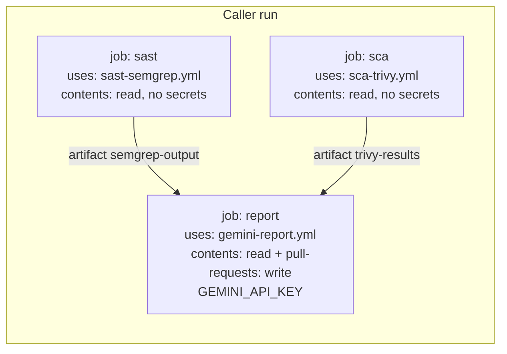

# Plan: SAST + SCA scanning and a findings-analysis stage

Status: **proposal, awaiting approval. No code has been written.**
Base: `ae4c89d` (+ `2d4f930`, which only adds `docs/CAPABILITIES.md`).

Marking used throughout: **(verified)** means I read the source or ran it.
**(inferred)** means I reasoned it and it needs confirming during implementation.
**(unverified)** means the primary source was unreachable from this environment.

---

## 0. Drift check and new facts

### 0.1 CAPABILITIES.md vs HEAD

**No code drift.** `git diff --stat ae4c89d HEAD` touches only
`docs/CAPABILITIES.md`, and `origin/main` has no new commits (verified).

Reading the callers turned up three places where CAPABILITIES.md (and the
README) describe the ecosystem wrongly. None of these is code drift; the
code is unchanged. I'll correct both docs in Stage 0.

| Claim in CAPABILITIES / README | Reality (verified in `jeffdecastro/dvwa`) |
|---|---|
| "Callers track `@main` with no releases" (§9, and your brief) | DVWA's newest branch `add-security-scan-workflow-v2` (2026-07-22) pins **both** `uses: …/gemini-report.yml@ae4c89df…` and `shared_ref: ae4c89df…` (`security-scan.yml:172,179`). Only the older branch `test/dast-zap-pipeline` uses `@main` (L176,183). |
| "No SARIF upload to code scanning" (§9, listed as a gap) | Missing from *this* repo, but DVWA already does it caller-side with `github/codeql-action/upload-sarif@08d09a5…` for both Semgrep and Trivy, and grants `security-events: write` at the top level (`security-scan.yml:26-28,68-80`). |
| DVWA runs "Semgrep, Trivy, ZAP" (README L18-20) | The v2 branch runs Semgrep + Trivy + **Nuclei**. ZAP runs only on `test/dast-zap-pipeline`. |

Neither repo's `master`/`main` carries a security workflow yet. It exists only
on DVWA's feature branches. I could not read **WebGoatJeff**: attaching it was
denied in this session. Everything about WebGoatJeff below comes from the
README (L497-518) and is **(unverified)**.

### 0.2 Facts that change the design

1. **Trivy SARIF cannot carry CWE (verified).** Trivy's `pkg/report/sarif.go`
   builds rule properties in `toProperties()` as `tags: [title, "security",
   severity]`, `precision`, `security-severity`, plus CVSS fields.
   `vuln.CweIDs` is never referenced. The parser can't recover CWE from a
   field that isn't there. Trivy's **JSON** output does carry `CweIDs` per
   vulnerability. See §3.2.
2. **Trivy had a supply-chain compromise (verified)**
   ([GHSA-69fq-xp46-6x23](https://github.com/aquasecurity/trivy/security/advisories/GHSA-69fq-xp46-6x23),
   CVE-2026-33634, 2026-03-19/20).
   - The attackers force-pushed trivy-action tags 0.0.1–0.34.2 and every
     `setup-trivy` tag, and shipped a malicious binary, v0.69.4.
   - The advisory names trivy-action **0.35.0** and binaries **v0.69.2/v0.69.3**
     as safe.
   - DVWA's `test/dast-zap-pipeline` pins `trivy-action@57a97c7…` (0.35.0).
     DVWA's v2 branch pins `trivy-action@ed142fd…`, labelled `v0.36.0`. **The
     advisory doesn't mention v0.36.0; verify that SHA before trusting it.**
3. **CodeQL does not support PHP (verified)** (codeql.github.com supported
   languages; GitHub community discussion #158392). That rules CodeQL out for DVWA.
4. **Gemini free-tier limits: (unverified).** `ai.google.dev` is blocked by
   this environment's egress proxy, so I couldn't read the rate-limit page.
   Secondary sources disagree:
   - roughly 20 RPD for the newest Flash generations;
   - 250–1,500 RPD for older Flash;
   - 500–1,000 RPD for Flash-Lite.

   ([cloudzero](https://www.cloudzero.com/blog/gemini-pricing/),
   [aipromptshub](https://aipromptshub.co/blog/gemini-api-free-tier-rate-limits),
   [pecollective](https://pecollective.com/tools/gemini-free-tier-guide/)).

   This repo's own history is consistent with the low end:
   - commit `33ca0fa` switched to `gemini-flash-latest` because
     "gemini-2.5-flash [was] blocked for this key tier";
   - the debug commits `740165a`/`29a3423` show the key's model list was being probed.

   **Design assumption: ~20 requests/day per project, shared by every caller
   using the same key.** Please read the real numbers for your key from AI
   Studio → Rate limits (see open question Q5).

---

## 1. Summary of the proposal

| Stage | What | New permissions | Changes existing behavior? |
|---|---|---|---|
| **0 (prerequisite, proposed)** | Fix the marker-author and appendix-escaping issues from CAPABILITIES §8, fix README drift, tag `v1.0.0` at the current head | none | Only the two security fixes |
| **1 SAST** | New reusable workflow `sast-semgrep.yml`: Semgrep CE container, SARIF artifact | none (`contents: read`) | No. Opt-in, separate workflow |
| **2 SCA** | New reusable workflow `sca-trivy.yml`: Trivy container, JSON + SARIF. New parser `trivy-json` with real CWEs. New optional `component` field in the schema | none (`contents: read`) | Schema gains one field (see §3.3) |
| **3 Analysis** | Deterministic grouping plus **one** structured Gemini call that replaces today's free-form call. Hash short-circuit. 429 stops retries | none | Yes. The narrative section becomes code-rendered from structured model output |

**None of the three stages needs `security-events: write`, `issues: write`,
or `checks: write`.** I'm deliberately not adding SARIF upload to the shared
workflows (§3.1.4), because it would force every caller to grant
`security-events: write`.

---

## 2. Architecture decision: where scanners run

### Options considered

| | A. Separate reusable scan workflows (**recommended**) | B. Add `run_sast`/`run_sca` flags to `gemini-report.yml` | C. Don't build. Keep scanners in callers |
|---|---|---|---|
| Job isolation | Scanner job has `contents: read`, **no secrets, no write token** | Scanner runs in the job that holds `GEMINI_API_KEY` and a `pull-requests: write` token | n/a |
| Blast radius of a compromised scanner image | Can read the checkout it was given. Nothing to steal | Can exfiltrate the Gemini key and write PR comments | Same as A, but owned by each caller |
| Caller change | Add 1–2 `uses:` jobs. Manifest unchanged in shape | Flip inputs | none |
| DAST later | Another producer workflow, same pattern | More flags on an already overloaded workflow | n/a |

**B is rejected.** After March 2026, running a third-party scanner binary in
the same job as a secret and a write token is exactly the pattern that burned
trivy-action users.

The shape of A:



`gemini-report.yml` keeps its current contract. The only link between
scanning and reporting is the artifact manifest, as it is today. A caller can
keep running its own scanners and never adopt Stage 1/2.

**I am not adding a wrapper workflow** that nests all three. A reusable
workflow's jobs can't be granted more than the calling job allows, so a
wrapper would make every caller grant the union of all permissions just to
use any part.

---

## 3. Stage designs

### 3.1 Stage 1: SAST

#### 3.1.1 Tool choice: Semgrep Community Edition

**Semgrep CE** (the `semgrep/semgrep` container, pinned by digest, run with
`semgrep scan`, not `semgrep ci`):
- needs no account, token, or paid tier for registry rulesets such as
  `p/default`, `p/php`, and `p/java`;
- emits SARIF natively, which lands on the existing `semgrep-sarif` parser
  with **zero parser changes** (`normalize.py:111-145`, verified against
  DVWA's real output in README L769-782);
- covers PHP and Java at the single-file level.

DVWA already runs exactly this image by digest
(`semgrep/semgrep@sha256:2b33f46b…`, `security-scan.yml:45`). The shared
workflow would standardize a known-working setup rather than introduce a new tool.

Things to know:
- The Semgrep-maintained rules are under the Semgrep Rules License, which
  permits internal use. Fine here. Re-check if this pipeline is ever offered
  to third parties.
- CE is intra-file only. Cross-file taint needs the paid engine.
- `--metrics=off` should still work with `p/*` rulesets **(inferred; confirm in Stage 1 CI)**.

**Runner-up: Opengrep** (the LGPL fork of Semgrep CE, created after
Semgrep's 2024–25 licensing changes). It has the same rule syntax and SARIF
output and no rules-license question. I rejected it for now because:
- it has no hosted registry, so we would have to vendor and maintain a rules
  checkout ourselves;
- it's a younger project with less release history;
- DVWA's existing Semgrep setup and its validated parser output would change
  for no gain today.

It's the drop-in fallback if Semgrep's licensing tightens further.

CodeQL is **disqualified**: no PHP support, and private repos need paid
GitHub Advanced Security.

#### 3.1.2 Workflow `sast-semgrep.yml` (new)

- `on: workflow_call`. Inputs, each validated by regex in a first step:
  - `semgrep_configs`, default `p/default`, regex
    `^p/[a-z0-9-]+(,p/[a-z0-9-]+){0,9}$`. Registry packs only: no local paths,
    no `r/` single rules, no URLs. DVWA would pass
    `p/php,p/security-audit,p/owasp-top-ten,p/cwe-top-25`.
  - `artifact_name`, default `semgrep-output`, regex `^[A-Za-z0-9._-]{1,64}$`.
- Top-level `permissions: {}`. The job has `permissions: contents: read`.
  **No `secrets:` block.**
- Steps:
  1. Validate inputs.
  2. `actions/checkout@<sha>` of the **caller** repo with `persist-credentials: false`.
  3. Split `$SEMGREP_CONFIGS` into an array in bash, from `env:`, and run
     `docker run … semgrep/semgrep@sha256:<digest> semgrep scan --metrics=off --sarif --output=semgrep.sarif "${CONFIG_ARGS[@]}" .`
     with `continue-on-error: true` and `set -euo pipefail`.
  4. Write `scan-status.json` with `{tool, exit_code, ran: true|false}`.
  5. Upload `semgrep.sarif` and `scan-status.json` with `actions/upload-artifact@<sha>`, `if: always()`.
- No `${{ }}` in any `run:`. Everything goes through `env:`.

#### 3.1.3 "Scanner didn't run" signal (small, but important)

This is the most serious silent failure we'd be taking on. Today a missing
artifact is just absent (`gemini-report.yml:100-103`). Once this repo owns the
scanners, a registry or DB download failure would give "No security findings
to report", a **false all-clear**. The fix:
- `normalize.py` reads `scan-status.json` if present and emits a
  `scanners` status list alongside the findings;
- `build_appendix` prints `semgrep: ran` / `trivy: FAILED (exit 2)` / `not run`;
- the "No security findings" comment gets the same line.

Carrying this status through touches the normalize → report file contract.
Doing it cleanly means `normalize.py` writes a second file
(`scan-status-summary.json`) rather than changing its stdout array. That
avoids breaking any existing reader of `normalized-findings.json`.

#### 3.1.4 SARIF upload to code scanning: not in the shared workflow

It would need `security-events: write` on the scan job. **Every caller would
then have to grant it, even callers who don't want uploads**, because a
nested job's `permissions:` are checked against the caller's grant when the
workflow starts **(inferred from GitHub's reusable-workflow permission model;
the failure shows up at run start)**. Callers who want code scanning keep
their own `upload-sarif` step against the downloaded artifact, as DVWA does
today.

#### 3.1.5 Stage 1 tests

- A new CI job in `test.yml` calls `uses: ./.github/workflows/sast-semgrep.yml`
  against a small fixture app committed under `tests/fixtures/scan-target/`
  (one PHP and one Java file with a known SQLi). A follow-up job downloads the
  artifact, runs `normalize.py`, and asserts that at least one `CWE-89`
  appears. This is the first real test of workflow YAML in this repo.
- The input-validation regexes get unit tests. The bash regex is duplicated
  in a Python helper used only by tests, which matches the existing
  double-validation convention.
- **No parser changes.** Existing `TestSarifParser` coverage applies.

### 3.2 Stage 2: SCA with Trivy

#### 3.2.1 Execution

- New `sca-trivy.yml`. It has the same shape as §3.1.2: `contents: read`,
  no secrets, and validated inputs:
  - `trivy_scanners`, default `vuln,secret`, regex
    `^(vuln|secret|misconfig|license)(,(vuln|secret|misconfig|license)){0,3}$`;
  - `artifact_name`.
- It runs the **container** `aquasec/trivy@sha256:<digest-of-verified-safe-release>`,
  **not** `trivy-action` or `setup-trivy`. The container avoids the two
  wrapper actions whose tags were hijacked. It also avoids the action's
  implicit `setup-trivy` download, and it's one digest to verify instead of three.
- It runs **once** with `--format json --output trivy.json`, then
  `trivy convert --format sarif --output trivy.sarif trivy.json`. That gives
  one scan and two formats.
- **It uploads two separate artifacts**: `trivy-results` (JSON only) and
  `trivy-sarif` (SARIF only, for callers who upload to code scanning). This
  separation is required. The fetch step feeds *every* `*.json|*.sarif`
  file in an artifact to the same parser key (`gemini-report.yml:109-112`),
  so bundling both would double-parse.
- Known fragility: the Trivy vulnerability DB is pulled from `ghcr.io` and
  gets rate-limited. The workflow adds `--db-repository` with a fallback list
  (`ghcr.io/aquasecurity/trivy-db,public.ecr.aws/aquasecurity/trivy-db`) and
  caches the DB with `actions/cache@<sha>` keyed by date **(inferred flags;
  verify against the pinned Trivy version)**.

#### 3.2.2 The CWE-UNKNOWN fix: new `trivy-json` parser

The existing `trivy-sarif` parser **cannot** be fixed (§0.2.1). The new
`parse_trivy_json(path)` is modelled on `parse_zap`:

| Trivy JSON field | Normalized field |
|---|---|
| `Results[].Target` | `file` (the lockfile path, e.g. `composer.lock`, `pom.xml`) |
| `Vulnerabilities[].VulnerabilityID` | `rule_id` (the CVE/GHSA) |
| `Vulnerabilities[].CweIDs[0]` via `_normalize_cwe` | `cwe`. The first entry wins. Missing gives `CWE-UNKNOWN`, which is now the honest answer ("NVD didn't assign one"), not a parser gap |
| `Vulnerabilities[].Severity` (`CRITICAL`…`LOW`, `UNKNOWN`) | `severity`. `UNKNOWN` maps to `MEDIUM`, matching `_finding`'s default |
| `PkgName` + `InstalledVersion` | **new** `component`, e.g. `guzzlehttp/guzzle@7.4.0` |
| `FixedVersion`, `Title` | `description` = `"Fixed in <v>. <Title>"` (clamped) |
| `Secrets[]`, `Misconfigurations[]` | `rule_id` = `RuleID`/`ID`, `line` = `StartLine`/`CauseMetadata.StartLine`, `component` = `""` |

- **Severity parity caveat.** `trivy-sarif` derived severity from CVSS-score
  bands (`security-severity`). `trivy-json` uses Trivy's own `Severity`
  label. For a few CVEs the vendor label and the CVSS band differ, so
  switching a caller from `trivy-sarif` to `trivy-json` can move some findings
  one band. That's a one-time, documented shift. Severity stays
  scanner-derived and deterministic.
- `trivy-sarif` stays registered and unchanged for callers who don't migrate.
- Tests: a new `TestTrivyJsonParser` modelled on `TestZapParser`. It covers
  the happy path with `CweIDs`, the empty or missing `CweIDs` case, all
  severity bands including `UNKNOWN`, secrets and misconfigs, a missing
  `Results`, and entries that aren't dicts.

#### 3.2.3 Schema change: `component` (needs your approval, Q1)

The normalized schema gets an 8th key, `component`, which is an empty string
for everything except SCA. Why this is needed and not cosmetic:

- **Dedupe correctness.** Today the key is `(cwe, file, line, rule_id)`
  (`normalize.py:250`). Suppose one CVE affects two packages declared in the
  same `pom.xml`, and neither has a line. The two findings collide and one is
  silently lost. `component` joins the dedupe key.
  **(inferred: this can already happen with `trivy-sarif` when Trivy can't
  resolve a lockfile line. Stage 2 adds a regression test.)**
- **SCA grouping** (§3.3.2) needs the package, and it's otherwise only
  recoverable by regex over free-text messages.
- Callers affected: `test_schema_keys_are_stable` and README's schema table
  are updated. `build_appendix` shows `component` in the Location column
  when set. No known external reader of `normalized-findings.json` exists
  (**please confirm**).

### 3.3 Stage 3: analysis

#### 3.3.1 One call or two: **one**

| | Two chained calls (analysis → prioritization) | **One call, structured JSON out, narrative rendered in code** |
|---|---|---|
| Requests per changed run | 2 | **1** (same as today) |
| At ~20 RPD | ~10 PR runs/day across all callers | ~20 |
| Severity safety | Two free-text surfaces to police | Model returns only enums + short strings keyed by class id. Severity and CWE come from our data at render time, and **the model has no field that could carry them** |
| Failure modes | A partial failure leaves analysis without prioritization, which needs its own degraded path | One failure takes the one existing degraded path (`gemini_report.py:338-368`) |
| Quality | The second call can reason over the first's output | The model does both in one pass over a small (~2k-token) input. At this input size, chaining buys little |

**Recommendation: one call.** The "analysis agent" is a stage, not a second
model invocation:
- **deterministic pre-analysis in code:** grouping, heuristics, and the
  payload (§3.3.2–3.3.3);
- **one** Gemini call with `responseMimeType: application/json` and a
  `responseSchema`;
- **deterministic rendering in code.**

Today's free-form markdown narrative goes away. The model never writes
markdown again, so `sanitize_report` becomes a second line of defense behind
schema validation rather than the only one.

#### 3.3.2 Grouping and fan-out (new module `scripts/analysis.py`, stdlib)

`group_key(f)`:

- **SCA vulnerability** (`component != ""`): `("pkg", component)`. One
  vulnerable transitive dependency with 30 CVEs across 3 lockfiles becomes
  **one class**: "`guzzle@7.4.0`, 30 CVEs, max CRITICAL, fixed in ≥7.4.5".
  That is the remediation unit (one upgrade). It's why grouping by
  `(cwe, rule_id)`, as specified in the brief, is **wrong for SCA**: every
  CVE has a distinct `rule_id`, so grouping by it would save nothing.
- **Everything else:** `("rule", cwe, rule_id)`, as requested.

Each class gets a code-assigned id (`C1`…`Cn`), in the order of
`(max severity, instance count desc, key)`. The class record holds `max_sev`
(computed in code), `count`, up to 3 distinct sample **files** (no line
numbers, see §3.3.5), and a short description.

**Deterministic heuristics** are computed in code and sent to the model as
facts:
- `in_test_path` / `in_vendor_path`, from path patterns;
- `fix_available`, for SCA;
- `tools`, the tools that agreed (already joined by dedupe);
- `confirmed_by_dast`, left unset until DAST exists (§6).

**Fan-out:** the model returns annotations keyed by class id, and
`apply_annotations(findings, classes, annotations)` joins them back in code:
- unknown ids are dropped;
- invalid enum values become `unknown`;
- extra fields (e.g. a `severity` the model invents) are ignored, because
  the renderer reads only whitelisted keys;
- classes the model skipped are marked "not analyzed".

#### 3.3.3 Payload (minimum fields, compact)

- Only classes with `max_sev` at or above `analysis_min_severity` (a new
  input, default `HIGH`, regex `^(CRITICAL|HIGH|MEDIUM|LOW|INFO)$`). All
  findings still appear in the inventory.
- One compact JSON line per class, with `separators=(",", ":")` and no
  indentation:
  `{"id":"C3","sev":"HIGH","cwe":"CWE-89","rule":"php.lang.security.injection.tainted-sql-string","n":14,"files":["vulnerabilities/sqli/source/low.php","…"],"desc":"<≤160 chars>","h":["test_path"]}`
- `rule` is truncated to 100 characters, each file path to 100, and `desc` to 160.
- The instructions are short and fixed. The fields are explained once, in a
  single line.
- **Outer bounds are kept:** `MAX_FINDINGS_IN_PROMPT = 300` and
  `MAX_FINDINGS_CHARS = 300_000` still apply to the underlying findings.
  A new `MAX_CLASSES_IN_PROMPT = 60` caps the payload. Truncation is
  reported the same way as today.

#### 3.3.4 Response schema (enforced by Gemini and re-validated in code)

```json
{
  "classes": [{"id": "C3", "false_positive": "low|medium|high|unknown",
               "exploitability": "likely|possible|unlikely|unknown",
               "theme": "<≤40 chars>", "root_cause": "<class id or ''>",
               "note": "<≤200 chars>"}],
  "priority": [{"id": "C3", "reason": "<≤120 chars>"}],
  "summary": "<≤400 chars>"
}
```

Every string is re-clamped with `_clean`-equivalent logic, then escaped by a
hardened `_cell` (Stage 0 fix: escape `|`, backticks, `<`, `>`) before it
enters the comment. The whole rendered narrative still passes through
`sanitize_report`. `priority` is truncated to 5 entries.

#### 3.3.5 Generation config

`{"temperature": 0.2, "maxOutputTokens": 2048, "responseMimeType": "application/json", "responseSchema": {...}}`.
The values become module constants (`MAX_OUTPUT_TOKENS`, overridable by env,
clamped to 256–8192), not magic numbers.

**Thinking-token caveat (important):** on thinking-capable Flash models,
thinking tokens count against `maxOutputTokens`. A 2048 cap can end with
`finishReason=MAX_TOKENS` and **no text**. The existing `_extract_text`
already turns that into a clean `RuntimeError`, which triggers the degraded
path. The config therefore also sets the model's thinking control to its
minimum. The parameter name differs between model generations
(`thinkingBudget` vs `thinkingLevel`) **(inferred)**, which is one more
reason to **pin the model instead of using `gemini-flash-latest`** (Q5).

#### 3.3.6 Short-circuit: zero requests on unchanged re-runs

1. **No findings:** unchanged. There's no call today either (`gemini_report.py:331-334`).
2. **Unchanged payload:**
   - `payload_hash = sha256(canonical_json(classes_payload) + PROMPT_VERSION + MODEL + floor)`.
   - It's written as a second hidden line: `<!-- report-meta v=1 sha256=<hex> narrative=ok -->`.
     The first line stays exactly `MARKER`, so today's `startswith` lookup still works.
   - The narrative block is wrapped in code-emitted `<!-- narrative:start -->`/`<!-- narrative:end -->` markers.
   - On the next run: if the existing comment's meta has the same hash **and**
     `narrative=ok`, reuse its narrative block verbatim, rebuild the inventory
     from current findings, and PATCH. That costs **zero Gemini requests**.
   - Because the payload holds sample files, not line numbers, a push that
     only shifts lines keeps the hash stable. A new instance of a class
     changes `n`, which changes the hash, which spends a request. That's intended.
   - A previous comment with `narrative=degraded` always retries.
3. **Model output can't forge the meta line.** `sanitize_report` strips all
   HTML comments from model text (verified, L159), and the markers are emitted
   by code after sanitization.
4. **Dependency on Stage 0.** Reusing text from "the latest comment starting
   with the marker" is only safe once the lookup is limited to comments
   authored by `github-actions[bot]`. Otherwise anyone can post
   `MARKER + a matching meta line + arbitrary narrative` and have the bot
   re-post their text under its own name. **The short-circuit cannot ship
   before the marker-author fix.**

#### 3.3.7 Quota degradation

- **429 is never retried**, whether per-minute or per-day. At one request per
  run, a per-minute limit is almost never the cause, and a daily one can't
  clear within the job's 10-minute timeout. The code raises
  `QuotaExhausted(RuntimeError)` immediately, and `main()` takes the existing
  degraded path. The log line names the quota if the error body identifies it.
  Gemini returns `RESOURCE_EXHAUSTED` with a `QuotaFailure` detail whose
  `quotaId` mentions per-day or per-minute **(from memory, (unverified);
  harmless if wrong, because the classification only affects the message)**.
- **500/502/503/504 and network errors** keep today's backoff.
  `RETRY_STATUSES` becomes `{500, 502, 503, 504}`.
- The comment's degraded text changes to "AI analysis skipped: Gemini
  daily quota exhausted", so developers understand why it's missing.
- **Invalid JSON or a schema-violating response** is not retried, since it's
  likely deterministic for the same prompt. It takes the degraded path.

#### 3.3.8 Stage 3 tests (new `tests/test_analysis.py` plus additions to `test_gemini_report.py`, modelled on `TestAppendix`)

- **Grouping:**
  - SAST instances with the same `(cwe, rule_id)` form one class;
  - 30 CVEs on one component across 3 lockfiles form **one** class, with
    correct `count` and `max_sev`;
  - secrets and misconfigs group by rule;
  - the order is deterministic.
- **Floor:** MEDIUM classes are excluded from the payload at the default
  floor but present in the inventory.
- **Payload:** it has no newlines or indentation, `desc` is truncated at
  160, it contains no line numbers, and the hash is stable under input
  reordering and line shifts.
- **Fan-out:**
  - annotations reach every instance;
  - unknown ids are dropped;
  - bad enums become `unknown`;
  - a model-supplied `severity`/`cwe`/`file`/`line`/`rule_id` has **no
    effect** (assert the rendered output and the findings are unchanged);
  - `root_cause` pointing to an unknown id is dropped.
- **Rendering:** a model `note` containing `|`, a backtick,
  `<!-- gemini-security-report -->`, or `<script>` is neutralized.
- **Short-circuit:**
  - same hash + `ok` → `call_gemini` not called and narrative reused;
  - same hash + `degraded` → called;
  - different hash → called;
  - a meta line in a comment by another author → ignored.
- **Quota:**
  - 429 → exactly one `urlopen` call, inventory posted, exit 1, message names the quota;
  - 503 → retried as before;
  - invalid JSON → degraded.
- **Both LLM stages failing → inventory byte-identical** to the no-LLM case.
- **Request body:** asserts `maxOutputTokens`, `responseMimeType`, and
  `responseSchema` are present.

---

## 4. Per-run LLM cost

### Worked example: ~200 findings

Assumptions (explicit, because nothing measured matches 200 exactly):
- About 150 SAST findings across ~30 distinct `(cwe, rule_id)`. This is
  extrapolated from DVWA's measured run (85 Semgrep findings, README L776).
- About 50 SCA findings across ~8 vulnerable packages.
- About 40% of classes are at HIGH or above.

| | Today (`ae4c89d`) | Proposed |
|---|---|---|
| Items sent | 200 findings | 38 classes → **~15 classes** after the HIGH+ floor |
| Serialization | `indent=2`, descriptions up to 1,000 chars | compact, desc ≤160, no line numbers |
| Input size | ~140k chars ≈ **~35k tokens** (assumes ~700 chars per pretty-printed finding) | ~15 × 300 chars + ~2k chars of instructions ≈ **~1.6–2k tokens** |
| Output cap | 8,192 (hard-coded) | 2,048, with a schema-bounded response of ~1k tokens |
| Requests per changed run | 1 | **1** |
| Requests per unchanged re-run | 1 | **0** |
| Requests per run with a failed call | up to 4 (retries on 429) | 1 on 429, ≤4 only on 5xx |

The worst case is bounded by `MAX_CLASSES_IN_PROMPT = 60`, about 5k input
tokens. With the floor set to `INFO`, the example needs 38 classes, about
3.5k tokens.

**At ~20 RPD**, that's about 20 content-changing PR pushes per day **across
every caller sharing the key**. Tokens are no longer the constraint in any
scenario.

---

## 5. Migration impact

### DVWA (branch `add-security-scan-workflow-v2`; verified)

Today (L31-96) DVWA runs Semgrep and Trivy inline and uploads SARIF itself.
After Stage 1+2, if it opts in:

```yaml
permissions:
  contents: read            # top level; drop security-events: write unless keeping code scanning

jobs:
  sast:
    uses: jeffdecastro/security-pipeline-shared/.github/workflows/sast-semgrep.yml@<v1.1.0-sha> # v1.1.0
    permissions: { contents: read }
    with:
      semgrep_configs: "p/php,p/security-audit,p/owasp-top-ten,p/cwe-top-25"

  sca:
    uses: jeffdecastro/security-pipeline-shared/.github/workflows/sca-trivy.yml@<v1.2.0-sha> # v1.2.0
    permissions: { contents: read }
    with:
      trivy_scanners: "vuln,misconfig,secret"

  # OPTIONAL: keep code scanning. This caller-side job is the only one needing security-events: write.
  code-scanning:
    needs: [sast, sca]
    runs-on: ubuntu-latest
    permissions: { contents: read, security-events: write, actions: read }
    steps:
      - uses: actions/download-artifact@<sha>
        with: { pattern: "{semgrep-output,trivy-sarif}", merge-multiple: false }
      - uses: github/codeql-action/upload-sarif@08d09a53f0f5d694f253bd25732e4429c9e9337f # v3.37.2
        with: { sarif_file: semgrep-output/semgrep.sarif, category: semgrep }
      - uses: github/codeql-action/upload-sarif@08d09a53f0f5d694f253bd25732e4429c9e9337f # v3.37.2
        with: { sarif_file: trivy-sarif/trivy.sarif, category: trivy }

  dynamic-scan:            # unchanged: Nuclei stays caller-side

  gemini-report:
    if: always() && (github.event_name == 'pull_request' || github.event_name == 'workflow_dispatch')
    needs: [sast, sca, dynamic-scan]
    uses: jeffdecastro/security-pipeline-shared/.github/workflows/gemini-report.yml@<v1.3.0-sha> # v1.3.0
    permissions: { contents: read, pull-requests: write }
    with:
      pr_number: ${{ github.event.pull_request.number || inputs.pr_number }}
      artifact_manifest: "semgrep-sarif=semgrep-output,trivy-json=trivy-results,nuclei-jsonl=nuclei-results"
      shared_ref: <v1.3.0-sha>
      analysis_min_severity: HIGH
    secrets:
      GEMINI_API_KEY: ${{ secrets.GEMINI_API_KEY }}
```

What changes for DVWA:
1. Replace two inline steps with two `uses:` jobs.
2. Change `trivy-sarif=trivy-output` to `trivy-json=trivy-results` in the manifest.
3. Optionally move `upload-sarif` into its own job, so `security-events: write`
   is granted to that job only instead of at the workflow top level. That's
   an improvement on DVWA's current setup.
4. Bump the SHA pins.

**If DVWA does nothing, nothing breaks.** It is pinned to `ae4c89d`, and
every change is additive or opt-in. **One behavior change applies once it
bumps `gemini-report.yml` past Stage 3:** the narrative section is
code-rendered, in a different layout from today's free-form prose.

`test/dast-zap-pipeline` tracks `@main`. It will pick up Stage 0 and Stage 3
immediately on merge. None of these stages breaks it, but it should be
pinned.

### WebGoatJeff (unverified; README only)

It's expected to be the same shape: Semgrep + Trivy + Nuclei. It would use
`semgrep_configs: "p/java,p/security-audit,p/owasp-top-ten"`. **If it still
uses `@main` (README L505), it gets Stage 0 and Stage 3 without opting in.**
I need read access (or you) to confirm its ref and manifest before Stage 3 merges.

---

## 6. DAST later

This design **doesn't force a rewrite** for DAST, as long as three things stay true:

1. **Producers stay separate workflows that emit artifacts.** A future
   `dast-*.yml` is just another producer, and `nuclei-jsonl`/`zap-json`
   parsers already exist and stay untouched.
2. **Grouping doesn't assume file:line.** DAST findings have a URL in `file`
   and `line = 0`. `("rule", cwe, rule_id)` already groups ZAP alerts
   correctly (one alert name per class).
3. **The response schema doesn't hard-code "SAST/SCA".** Each class carries a
   `kind` (`sast|sca|secret|config|dast`) derived in code from the tool.
   Adding `dast` later is an enum value, not a schema redesign. The
   `confirmed_by_dast` heuristic slot is reserved now but left unset.

**Decide now:** keep the payload hash free of anything DAST-volatile. DAST
counts drift run to run (23 vs 24 alerts on an unchanged commit, README
L684-688). If DAST classes are ever hashed, the short-circuit will
effectively never hit and every run costs a request. When DAST arrives,
exclude its counts from the hash (hash only the set of class keys).

Whether DAST belongs in this repo at all is covered in §8.

---

## 7. Decisions needed from you

| # | Question | My recommendation |
|---|---|---|
| Q1 | Add the `component` field and the `trivy-json` parser (fixes CWE-UNKNOWN and SCA grouping), or stay SARIF-only and document CWE-UNKNOWN as unfixable? | Add it |
| Q2 | Is it acceptable that the narrative becomes code-rendered from structured model output (a different look from today's prose)? | Yes. It's what makes "severity never from the model" structural |
| Q3 | Should Stage 0 (marker-author fix, cell escaping, README drift, tag `v1.0.0`) land before Stage 1? | Yes. Stage 3's short-circuit depends on it |
| Q4 | Keep scanners as separate opt-in workflows (option A), or not build scanner execution at all (option C)? | A if you want it; see §8 for the case for C |
| Q5 | Which model, and what are your key's actual RPD/RPM (AI Studio → Rate limits)? Are any callers **private repos**? Google's free-tier terms allow prompts to be used to improve Google's products, which matters if private vulnerability details are sent | Pin an explicit Flash or Flash-Lite id. Paid tier or no LLM for private repos |
| Q6 | Stdlib-only, reporting-only, no gating. Are all three confirmed for this work? | Yes. No gating is added in any stage |
| Q7 | Can you give read access to WebGoatJeff, or confirm its ref and manifest? | Needed before Stage 3 merges |

---

## 8. Honest advice

### Should scanner execution live here at all?

**The strongest case against:**
- **DVWA already does this, and does it well.** It runs Semgrep by digest
  with PHP-specific rulesets and Trivy pinned to a SHA, and it uploads SARIF
  to code scanning (verified). Moving that here removes about 60 lines of
  YAML from each of **two** callers. That's the entire benefit today.
- **Scanner configuration is inherently per-repo.** Rulesets, ignore files
  (`.semgrepignore`, `.trivyignore`), languages, and which scanners to enable
  all vary. Every one becomes a validated input here, and the inputs will
  keep growing.
- **You inherit a patch treadmill and a blast radius.**
  - Every Semgrep/Trivy digest bump becomes this repo's job.
  - A bad push (or a poisoned image you pinned) runs in every caller at once.
    March 2026 is the proof that "a pinned security scanner" is a real attack
    vector. Option A limits the damage to "can read the checkout", but it
    doesn't remove it.
- **It dilutes the property that made this repo easy to trust:** it only reads
  artifacts, never code. After Stage 1 it checks out and processes every
  caller's source.

**The case for it:**
- It puts the output format next to the parser that consumes it. The
  `trivy-json` switch is much easier if you control the producer.
- It gives one place to verify digests after incidents like Trivy's.
- New callers get a working pipeline in 3 jobs.

**My verdict:** with two callers, one of which already has this working, it's
**low value**. Build it only as opt-in, isolated workflows (option A), and
only after the items I rank higher below. If this stays a two-caller personal
setup, option C is defensible: keep scanners in callers, add `trivy-json` as
a parser only, and document the producer command in the README.

### Is the second agent worth it?

**As a second LLM call: no.** Most of the benefit comes from things code can
do for free:
- collapsing 30 CVEs into "upgrade guzzle to ≥7.4.5";
- grouping 14 identical SQLi hits into one class;
- flagging hits in `tests/` or `vendor/`;
- "fix available", and "two tools agree".

That's the 80%, at zero requests.

What the model adds on top is weaker than it sounds. **It never sees source
code.** This workflow deliberately only reads artifacts, and Semgrep CE's
SARIF may not include snippet text without a login **(inferred)**. So its
"likely false positive" and "exploitable in context" verdicts are priors
about a rule name and a file path, not analysis. It will sound confident
anyway. The honest version of Stage 3 is deterministic grouping plus
heuristics, followed by **the same single call you already make**, now
cheaper and structured. That's what this plan proposes. I'd call it
"analysis stage", not "agent", in the docs.

If you want real FP triage, the model needs code context: a ±5-line snippet
per class sample. That means either the report job checks out the caller's
code, or the scan job exports snippets into the artifact. The second is
safer. It's a meaningful expansion of what reaches the model and the comment,
and I'd treat it as its own later decision.

### Does this leave room for DAST?

Yes. See §6. The only decision to make now is to keep DAST volatility out of
the cache hash.

**Should DAST live in this repo?** I'd say **no**. The hard part of DAST is
booting the target app. For DVWA that's a compose build, a readiness loop,
and a CSRF-token dance against `setup.php` (verified, `security-scan.yml:108-136`).
All of that is app-specific. A shared workflow could only offer "scan this
URL", which is a single `docker run` and not worth a shared abstraction. Keep
DAST execution in callers. The parsers here are the right level of sharing.

### What I'd do instead, in priority order

1. **Stage 0 security fixes.** These are live bugs in shipped code today:
   - the upsert matches any author's comment, so someone can post a marker
     comment and have the bot PATCH it;
   - scanner-controlled `file`/`rule_id` values reach the comment without
     backtick or HTML escaping.

   Small, testable, and a prerequisite for caching.
2. **Cut Gemini cost within the existing single call:** grouping, the
   compact payload, the floor, the hash short-circuit, and 429 → no retry.
   This is Stage 3 without the new-agent framing, and it's the only item
   that addresses your binding constraint (RPD).
3. **`trivy-json` parser + `component` in the dedupe key.** This fixes
   CWE-UNKNOWN and the probable over-merge. It's parser-only, so callers can
   produce the JSON themselves.
4. **Tag releases** (`v1.0.0` = `ae4c89d`) and pin `test/dast-zap-pipeline`.
   DVWA's v2 branch already shows the right pattern (SHA pin + comment).
5. **Diff awareness ("new in this PR").** For developers this beats
   everything else on the list. A comment that says "3 new findings in your
   change" gets read; 114 findings, mostly pre-existing, do not. Semgrep
   supports `--baseline-commit`. For SCA, compare against the base branch's
   lockfile findings. That's a bigger design, worth its own plan.
6. **Shared scan workflows (Stages 1–2).** Last, and opt-in.

SARIF upload to code scanning doesn't need to move here. DVWA already does
it, and moving it would cost every caller `security-events: write`.

### What will bite you if you build it as specified

- **`gemini-flash-latest` combined with a tight `maxOutputTokens`.** When the
  alias moves to a new generation, both the thinking parameter and the free
  quota can change underneath you. The first symptom will be empty
  `MAX_TOKENS` responses or 429s, with nothing in this repo having changed.
  Pin the model.
- **One API key's daily quota is shared across all callers.** One busy day on
  one repo empties the narrative for every repo. The short-circuit helps, but
  it doesn't change that.
- **Free-tier data terms.** If any caller is private, you'd be sending its
  vulnerability inventory to a tier whose prompts may be used for product
  improvement (Q5).
- **Silent false all-clear.** If the Trivy DB download is rate-limited or the
  Semgrep registry is unreachable, `continue-on-error` gives you an empty
  artifact and a "No security findings" comment. The scanner-status line
  (§3.1.3) isn't optional polish. Without it, owning the scanners makes the
  report *less* trustworthy.
- **The grouping key as literally specified** (`(cwe, rule_id)`) saves
  nothing on SCA, the exact case you flagged. It has to be per-component.
- **Digest maintenance.** Dependabot won't update images referenced inside
  `docker run` lines **(inferred)**. Each scanner bump is a manual
  verify-and-pin, and after March 2026 you should do it deliberately, not
  automatically.
- **Comment format change.** Anyone who got used to the prose narrative will
  notice. Callers on `@main` get it without asking.
- **"Agent" framing will set expectations the stage can't meet.** Without
  code context, its FP verdicts are guesses. Label them as such in the
  rendered comment (for example "model estimate, not verified").

---

## Sources

- Trivy SARIF writer: `https://raw.githubusercontent.com/aquasecurity/trivy/main/pkg/report/sarif.go` (read in this session)
- [Trivy advisory GHSA-69fq-xp46-6x23](https://github.com/aquasecurity/trivy/security/advisories/GHSA-69fq-xp46-6x23)
- [Microsoft: Trivy supply chain compromise guidance](https://www.microsoft.com/en-us/security/blog/2026/03/24/detecting-investigating-defending-against-trivy-supply-chain-compromise/)
- [CodeQL supported languages](https://codeql.github.com/docs/codeql-overview/supported-languages-and-frameworks/), [PHP discussion #158392](https://github.com/orgs/community/discussions/158392)
- [Semgrep CLI reference](https://docs.semgrep.dev/cli-reference)
- Gemini free tier (secondary; primary blocked): [cloudzero](https://www.cloudzero.com/blog/gemini-pricing/), [aipromptshub](https://aipromptshub.co/blog/gemini-api-free-tier-rate-limits), [pecollective](https://pecollective.com/tools/gemini-free-tier-guide/)
- `jeffdecastro/dvwa` branches `add-security-scan-workflow-v2` @ `31b3e82`, `test/dast-zap-pipeline` @ `7a1c0b8` (read in this session)
